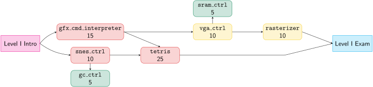

<div align="center">


<p>
Florian Huemer, Dylan Baumann, Sebastian Wiedemann
</p>
</div>


[[_TOC_]]


Welcome to the DDCA assignment repository.


# Course Overview

For a description of the overall course structure, please consult the introduction slides in TUWEL.


# Collaboration Policy

Please keep in mind that the main purpose of the regular tasks in this course is to give you the opportunity to **practice for the exams**.
Hence, submitting a solution that you did not come up with yourself and that you might not fully understand has only very limited value to you.
It is in your best interest to try to solve the tasks yourself.
Of course, it is allowed (and even encouraged) to talk to your colleagues, discuss ideas, and to seek assistance from AI while working on solutions.
However, keep in mind that during the exam, you have no internet access and you will have to rely solely on your own knowledge and understanding.

We will use a plagiarism-checker to cross-check all submissions.
Cheating, of any kind, will lead to a negative grade on the course (irrespective of points you might have achieved already).
This also applies to the exams.
See the [Plagiarism Policy](https://www.tuwien.at/mwbw/im/ao/lehre/abschlussarbeiten/plagiarismus) of TU Wien for more details.


# Structure of this Repository

The root directory of this repository contains the following subfolders

* `lib`: Here we store library modules and packages that will be used throughout the course. Don't make any changes here.
* `util`: This folder contains Makefile templates, used to build and simulate your code. Don't make any changes here.
* `tasks`: The actual tasks are located here. Your own code (i.e., your solutions) also goes here.

Furthermore, there is a [submission scipt](submission.py) which you will use to submit your solutions.
You can learn more about it by running it and reading its synopsis.


# First Steps

## Clone the Repository
Be sure to use `git` to actually clone this repository.
**Do not** just download it as an archive, because we will push updates during the semester and you will have a hard time tracking the changes otherwise.

## Retrieve your TILab Account
To retrieve your TILab account go to [password.tilab.tuwien.ac.at](https://password.tilab.tuwien.ac.at) and login with your TISS credentials.
Should you forget your TILab password, you can also reset it using this site.

## Download the VM
If you want to work on your own computer, we recommend downloading our (Virtual Box) VM image from the TILab server.
To do that you can either go to the TILab and copy the image to an USB stick or use the following command.

```bash
scp USERNAME@ssh.tilab.tuwien.ac.at:/opt/eda/vm/ECS-EDA-Tools-VM.tar.xz .
```

`USERNAME` is your TILab username you got in the previous step.

To extract the archive use the following command (under Windows you can use e.g., [7-zip](https://7-zip.org/).):

```bash
tar -xf ECS-EDA-Tools-VM.tar.xz
```

The root/user password for the VM is `ecseda`.
You can change it using the `passwd` command.

On a Linux host system the VM can also be used with libvirt-based tools, like [GNOME Boxes](https://apps.gnome.org/Boxes/) or [virt-manager](https://virt-manager.org/).
For older versions of GNOME Boxes it might be necessary to first convert the virtual disk image (`ECS-EDA-Tools.vdi`) to a different format:

```bash
qemu-img convert -f vdi -O qcow2 ECS-EDA-Tools.vdi ECS-EDA-Tools.qcow2
```

## Remote Lab Setup

If you plan to use the Remote Lab, you have to install our access tools.
Please run the following command on the computer from which you want to access the Remote Lab (i.e., most probably the VM).

```bash
pip install git+https://git.inf2.tuwien.ac.at/sw/rpatools
```

This command installs the tool `rpa_shell` -- RPA standing for Remote Place Assigner.
You can run it using the `-h` command line argument to access its documentation.

If you run `rpa_shell` for the first time, it starts a configuration wizard, where it asks for the RPA server URL, which is `ssh.tilab.tuwien.ac.at`.
Your login credentials are the same as for the (local) TILab.

# Level Overview

## Level I

| task | Points | Keywords (Topics) |
|-|-|----|
| [snes_ctrl](tasks/level1/snes_ctrl/task.md) | 10 | FSM, External Interface |
| [gfx_cmd_interpreter](tasks/level1/gfx_cmd_interpreter/task.md) | 15 | Advanced Testbench, Specifications |
| [tetris](tasks/level1/tetris/task.md) | 25 | FSM, Specifiacations, Filling Gaps, Reading Code |
| [vga_ctrl](tasks/level1/vga_ctrl/task.md) | 10 | External Interface, Advanced Testbench, Oscilloscope |


# Library Core Overview
In the table below you can find an overview over all currently available library cores.
Clicking the link brings you to the core's documentation where you can find more information.
Feel free to use them in your designs as you see fit.

| Library Core | Package Documentation |
|-|-|
| Mathematical Support Package | [math](lib/math/doc.md) |
| On-Chip Memory Package | [mem](lib/mem/doc.md) |
| Synchronizer Package | [sync](lib/sync/doc.md) |
| Utility Support Package | [util](lib/util/doc.md) |
| SNES Controller Package | [snes_ctrl](lib/snes_ctrl/doc.md) |
| Testbench Utility Package | [tb_util](lib/tb_util/doc.md) |
| Top Module | [top](lib/top/doc.md) |
| Graphics Command Interface Core Package | [gfx_core](lib/gfx_core/doc.md) |
| VGA Controller | [vga_ctrl](lib/vga_ctrl/doc.md) |
| Tetris Utility Package | [tetris_util](lib/tetris_util/doc.md) |
| Decimal Printer Package | [decimal_printer](lib/decimal_printer/doc.md) |
| VGA Graphics Controller Package | [vga_gfx_ctrl](lib/vga_gfx_ctrl/doc.md) |

