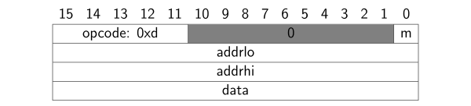

# Graphics Command Interface Core Package
The `gfx_core_pkg` package specifies the graphics command interface that can then be implemented by modules to either accept and execute graphics commands, or to issue them in order to draw something. It also provides a range of constants, custom types and functions to ease implementing and interacting with such interfaces.


[[_TOC_]]

## Required Files

- [gfx_core_pkg.vhd](src/gfx_core_pkg.vhd)


## Overview

For the context of this specification we refer to graphics command interfaces (GCIs) on modules that accept and execute graphics commands as *sink interfaces*, while GCIs that issue graphics commands are referred to as *source interfaces*.

GCIs support simple graphical operations on bitmaps using a command-based interface.
These operations include simple geometric operations (e.g., setting individual pixels, drawing lines, etc.) as well as the ability to copy and transform (i.e., rotating) a section of one bitmap onto another one, an operation also referred to as [bit blitting](https://en.wikipedia.org/wiki/Bit_blit).
Bitmaps are stored in video RAM (VRAM), which is accessed an manipulated via the commands of the GCI.
The VRAM size is implementation dependent, but must not be larger than 4 GB.

The interface specification consists of two parts:
  * The actual *physical interface*, defining the involved signals, their data types and the interface protocol.
  * The *command format* specifying the supported commands, their format, and their semantics as well as internal data structures a sink interface has to maintain.


### Physical Interface

The physical interface consists of two record types:


```vhdl
type gci_in_t is record
	wr_data : gfx_cmd_t;
	wr      : std_ulogic;
end record;
```


```vhdl
type gci_out_t is record
	full       : std_ulogic;
	rd_data    : gfx_cmd_t;
	rd_valid   : std_ulogic;
	frame_sync : std_ulogic;
end record;
```


Hence, a VHDL entity implementing the GCI must feature a port signal of type `gci_in_t` and one of type `gci_out_t`.

The directional indicators `in` and `out` used in the record names have to be read from the point of view of a sink interface.
This means that a sink interface must have an input of type `gci_in_t`, while a source interface must have an output of that type and vice versa.
Note that `gfx_cmd_t` is declared as a `std_ulogic_vector` subtype with a width of 16 bit.

Graphics commands are fed into a sink using `wr` and `wr_data` signals of the `gci_in_t` record.
For each data element provided at the interface, `wr` must be high for exactly one clock cycle.
In this cycle `wr_data` must be valid.
In all other cycles, where `wr` is low, the value of `wr_data` does not matter.
However, the `wr` signal must only be asserted if the `full` signal of the sink's output of type `gci_out_t` is low.
Hence, the port formed by `wr`, `wr_data` and `full` behaves exactly like the write port of a FIFO.

The signals `rd_data` and `rd_valid` of the `gci_out_t` record are used to retrieve data from the interface (e.g., from read operations on the VRAM).
Whenever the interface outputs a new data item to `rd_data`, `rd_valid` is asserted for exactly one clock cycle.
The data on `rd_data` remains valid until `rd_valid` goes high again.

The `frame_sync` signal is only activated for a single clock cycle in response to the execution of a certain command and allows the synchronization of a source interface to the start of a new frame output.


### Command Format

A graphics command always consists of a 16 bit instruction and a number of 16 bit operands associated with this instruction.
Depending on the instruction the number of operands can range from 0 to 4, with one command having a variable number of upto $`2^{16}+3`$ operands.
This means that for most commands multiple 16 bit words must be issued to the GCI using the inputs `wr` and `wr_data`.


In the following we refer to a VHDL module that implements the CGI as sink as a graphics core.
On a very basic level a graphics core must be able to display images to a user.
This can be image files on the file system of a computer (in the case of a simulation setting), or via some interface to a display in hardware (e.g., VGA, HDMI, etc.).

Internally, a graphics core must maintain a number of data structures that define its state and that are used by and modified through the execution of graphics commands.
The actual VRAM is the largest of these data structures as it stores the actual image data in the form of bitmaps.
Graphics commands are executed by reading and writing pixel data from and to these bitmaps.
This VRAM is byte-addressed and every address corresponds to the 8-bit color value of a single pixel in the [RGB332](https://en.wikipedia.org/wiki/List_of_monochrome_and_RGB_color_formats#3-3-2_bit_RGB_or_8-8-4_levels_RGB) format (no other color formats are supported).
Since the VRAM size is implementation dependent, in the following its address width is referred to as `VRAW`.

The other (much smaller data structures) are listed below:
- Active Bitmap Descriptor `abd` (30 + `VRAW` bit)
  - `abd.w` (unsigned 15 bit)
  - `abd.h` (unsigned 15 bit)
  - `abd.b` (unsigned `VRAW` bit)
- Graphics Pointer `gp` (32 bit)
  - `gp.x` (signed 16 bit)
  - `gp.y` (signed 16 bit)
- Colors
  - Primary Color `pcol` (8 bit)
  - Secondary Color `scol` (8 bit)
- Bitmap Descriptor Table `bdt` (8 active bitmap descriptors: 8x(30 + `VRAW`) bit)
  - `bdt[0]`
    - `bdt[0].b` (unsigned `VRAW` bit)
    - `bdt[0].w` (unsigned 15 bit)
    - `bdt[0].h` (unsigned 15 bit)
  - ...
  - `bdt[7]`
    - `bdt[7].b` (unsigned `VRAW` bit)
    - `bdt[7].w` (unsigned 15 bit)
    - `bdt[7].h` (unsigned 15 bit)
- Bit Blit Effect (10 bit)
  - `maskop` (2 bit)
  - `mask` (8 bit)

In an actual hardware implementation the VRAM is usually stored in some large (external) memory, while the rest of the data structures ends up in internal registers.
Upon reset, it can be assumed that VRAM contains random data, while the registers storing the remaining data structures are set to zero.


Bitmap Descriptors (BDs) are used to identify bitmaps in VRAM, by their base address (`b`) as well as their width (`w`) and height (`h`).
Given the pixel coordinates `x` and `y` for some pixel in a bitmap, its effective address in VRAM is given by:

```
effective pixel address = b + y * w + x
```

The coordinate (`x`,`y`)=(0,0) points to the pixel of the upper left corner of the bitmap, while (`x`,`y`)=(`w`-1,`h`-1) points to the lower right corner.
Note that bitmaps must always start at even addresses in VRAM (i.e., the LSB of the base address must be zero).


The `abd` defines the bitmap that is the target of all subsequent drawing operations.
The `gp` represents a 2D coordinate on this bitmap (i.e., the current image in VRAM that the graphics instructions draw to) and is used by most drawing commands (e.g., `SET_PIXEL`, `DRAW_HLINE`, `BB_*`, etc.).
The coordinate `gp.x`=0, `gp.y`=0 points to the pixel of the upper left corner of the bitmap, while `gp.x`=`abd.w`-1, `gp.y`=`abd.h`-1 points to the lower right corner.
Since `gp.x` and `gp.y` are **signed 16 bit** values, it is possible that the `gp` points to a location outside of the bounds of the active bitmap.
This is completely fine, as the graphics core must ensure that a write access to a pixel outside of the bounds, will simply have no effect (i.e., it performs clipping).
Hence, drawing a line from (0,0) to (10,0) will produce the exact same result as drawing a line from, e.g., (-10,0) to (10,0).
The `gp` is changed explicitly using the `MOVE_GP` and `INC_GP` instructions.
However, all drawing commands offer the possibility to automatically move the `gp` upon command completion.

The `bdt` holds 8 bitmap descriptors that are used (referenced) by certain commands (using the 3 bit instruction field `bmpidx` as an index to this table).
The `BB_*` commands always read this table to get the descriptors of the source bitmap of the blitting operation.
Data is written to the `bdt` using the `DEFINE_BMP` command.
Furthermore, the commands `DISPLAY_BMP` and `ACTIVATE_BMP` read the `bdt`.

The core also contains two 8 bit color registers, the primary (`pcol`) and the secondary (`scol`) color.
An instruction can refer to one of these colors using its `cs` (color selector) field, where 0 (1) refers to the `pcol` (`scol`).
The colors are set using the `SET_COLOR` instruction.

A few commands (`VRAM_*`, `DEFINE_BMP`) have to specify a VRAM address in their operands.
Since graphics commands are only 16 bits wide and a VRAM address requires upto 32 bits, two operands (`addrlo` and `addrhi`) are used for this purpose.
The resulting VRAM (byte) address is obtained by concatenating the lower 16 bits (`addrlo`) with the upper 16 bits (`addrhi`), which we denote by `addrhi & addrlo`.
The `VRAM_*` commands allow accessing individual bytes and words in VRAM (in the context of this specification a word is considered to be 16 bit. i.e., 2 bytes, wide).
Accessing words is only permitted on even addresses, i.e., the LSB of the address must be zero.
The byte order used is little-endian.
Assume that 0x12 is stored in address 0x0 in VRAM and that address 0x1 stores 0x34.
Reading a word from address 0x0, thus, returns 0x3412.
The behavior for accessing a memory location outside of the physical bounds of VRAM is **undefined**.


The `BB_CLIP` command is the most generic of the bit blit commands, but needs 4 separate arguments.
For this reason the core also supports the simpler `BB_FULL` and `BB_CHAR` commands.
The following (Python) listing demonstrates how the bit blit operations calculate the read address for a pixel in the source bitmap and the write address for the respective pixel destination bitmap.

```python
#!/bin/env python3

from collections import namedtuple
from enum import Enum

BD = namedtuple("BD", ["base_address", "width", "height"])
BMPSection = namedtuple("BMPSection", ["x", "y", "width", "height"])
Point = namedtuple("Point", ["x", "y"])
Rotation = Enum("Rotation", "R0 R90 R180 R270")

def BitBlit(
  dst: BD,
  dst_position: Point,
  src: BD,
  src_section: BMPSection,
  rotation: Rotation
):
  for x in range(0, src_section.width):
    for y in range(0, src_section.height):
      dst_x_offset = src_section.width-1-x if rotation in [Rotation.R180, Rotation.R270] else x
      dst_y_offset = src_section.height-1-y if rotation in [Rotation.R90, Rotation.R180] else y
      if rotation in [Rotation.R90, Rotation.R270]:
        # swap coordinates
        dst_x_offset, dst_y_offset = dst_y_offset, dst_x_offset
      dst_x = dst_position.x + dst_x_offset
      dst_y = dst_position.y + dst_y_offset
      src_x = src_section.x + x
      src_y = src_section.y + y

      src_addr = src.base_address + src_y * src.width + src_x
      dst_addr = dst.base_address + dst_y * dst.width + dst_x
      print(f"source pixel ({src_x},{src_y}) (addr={hex(src_addr)}) --> destination pixel ({dst_x},{dst_y}) (addr={hex(dst_addr)})")

BitBlit(
  dst=BD(0,320,240),
  dst_position=Point(10, 20),
  src=BD(320*240,8,4),
  src_section=BMPSection(0,0,4,4),
  rotation=Rotation.R0
)
```

Now a detailed bit-level specification of each command by the follows.
Note that graphics cores do not check or prevent overflows in the `gp` or the execution of bit blit operations with illegal source image section dimensions.
In such a scenario the behavior of the core becomes **undefined**.


#### NOP

**Format**:


**Format**:

Do nothing.


#### MOVE_GP

**Format**:


**Format**:


Sets the `gp` to (`x`,`y`).
If the `rel` (relative) bit is set, `x` and `y` will instead be added to the current `gp` (i.e., `gp.x` += `x`, `gp.y` += `y`).
The operands `x` and `y` are signed 16-bit values.


#### INC_GP

**Format**:


**Format**:


Adds the signed 10 bit integer in `incvalue` to either `gp.y` (`dir`=1) or `gp.x` (`dir`=0).
For that purpose `incvalue` is sign-extended.


#### CLEAR

**Format**:


**Format**:


Sets every pixel in active bitmap to the color specified by `cs`.
Does not change the `gp`.


#### SET_PIXEL

**Format**:


**Format**:


Sets the pixel in the active bitmap the `gp` currently points at to the color specified by `cs`.
If the `gp` is outside of the bounds of the active bitmap no pixel is set.
After that `gp.x` (`gp.y`) is incremented by one if `mx` (`my`) is set.


#### DRAW_HLINE

**Format**:


**Format**:


Draws a horizontal line between the `gp` and the destination coordinate at (`gp.x` + `dx`, `gp.y`) using the color specified by `cs`.
The operand `dx` is a signed 16-bit value.
After the line has been drawn `gp.x` is set to the destination *x* coordinate of the line if `mx` is set.
If `my` is set `gp.y` is incremented by one.


#### DRAW_VLINE

**Format**:


**Format**:


Draws a vertical line between the `gp` and the destination coordinate at (`gp.x`, `gp.y` + `dy`) using the color specified by `cs`.
The operand `dy` is a signed 16-bit value.
After the line has been drawn `gp.y` is set to the destination *y* coordinate of the line if `my` is set.
If `mx` is set `gp.x` is incremented by one.


#### DRAW_CIRCLE

**Format**:


**Format**:


Draws a circle with a radius specified by the operand `radius` and its center at the `gp` using the color specified by `cs`.
The operand `radius` is an unsigned 15 bit value.
After the circle has been drawn `gp.x` (`gp.y`) is incremented by `radius` if `mx` (`my`) is set.


#### GET_PIXEL

**Format**:


**Format**:


Reads the color of the pixel in the active bitmap the `gp` currently points to and outputs it using `rd_data`/`rd_valid`.
Since pixels are 8 bits wide only the lower 8 bits (i.e., 7 downto 0) of `rd_data` are used.
The upper bits are set to zero.
If the `gp` is outside of the bound of the active bitmap all bits in `rd_data` are set.
After that `gp.x` (`gp.y`) is incremented by one if `mx` (`my`) is set.


#### VRAM_READ

**Format**:


**Format**:


Performs a read operation on the VRAM address `addrhi` & `addrlo` and outputs the result using `rd_data`/`rd_valid`.
If `m` is 0, a byte access is performed.
In this case the upper byte (15 downto 8) in `gfx_rd_data` is set to zero and the read byte is placed in the lower byte (7 downto 0).
If `m` is 1, a word access is performed.
For a word access the LSB of the address must be zero.
A memory access outside of the physcial bounds of the VRAM is **undefined**.


#### VRAM_WRITE

**Format**:



**Format**:


Writes a single byte (`m`=0) or word (`m`=1) to VRAM.
If a byte access is performed only the lower 8 bits of the `data` operand are used, the upper 8 bits are ignored.
For a word access the LSB of the address must be zero.
A memory access outside of the physcial bounds of the VRAM is **undefined**.


#### VRAM_WRITE_SEQ

**Format**:


**Format**:


Writes a sequence of bytes (`m`=0) or words (`m`=1) to VRAM starting at the address `addrhi` & `addrlo`.
In byte mode (`m`=0) only the lower 8 bits of each of the operands `data[0]` to `data[n-1]` are used.
The last address written is (`addrhi` & `addrlo`) + `n` - 1.
In word mode (`m`=1) the last address written is (`addrhi` & `addrlo`) + 2*(`n` - 1).
A memory access outside of the physcial bounds of the VRAM is **undefined**.


#### VRAM_WRITE_INIT

**Format**:


**Format**:


Initializes a range of memory addresses starting at `addrhi & addrlo` to `data`.
In byte mode (`m`=0) only the lower 8 bits of the operand `data` are used.
The last address written is (`addrhi & addrlo`) + `n` - 1.
In word mode (`m`=1) the last address written is (`addrhi & addrlo`) + 2*(`n` - 1).
A memory access outside of the physcial bounds of the VRAM is **undefined**.


#### SET_COLOR

**Format**:


**Format**:


Sets the primary (secondary) color to `color` if `cs` is 0 (1).
For the actual color value in `color` the RGB332 format is used.


#### SET_BB_EFFECT

**Format**:


**Format**:


Sets the current BB Effect (i.e., the registers `maskop` and `mask`) used by all subsequent `BB_*` commands.
See the entry for `BB_CLIP` for the purpose of these registers.


#### DEFINE_BMP

**Format**:


**Format**:


Writes a Bitmap Descriptor to `bmpidx`.
Bitmaps always start at even addresses.
This means that the LSB of the low address is assumend to be zero.


#### ACTIVATE_BMP

**Format**:


**Format**:


Sets the Active Bitmap Descriptor by **copying** `bdt[bmpidx]` to the `abd`.
All subsequent drawing commands will use this bitmap as their target.
Changing `bdt[bmpidx]` with a subsequent `DEFINE_BMP` command does not affect the `abd`.


#### DISPLAY_BMP

**Format**:


**Format**:


Displays the bitmap indentified by `bmpidx`.
An implementation may choose to only support a certain number of width/height configurations for actually displaying bitmaps.

If the frame synchronization flag `fs` is 1, the command blocks the execution of the following graphics commands until the hardware displaying the frame is in a certain state.
This feature can be used to synchronize frame buffer switches in double buffering scenarios.
If `fs`=1 the `frame_sync` signal is asserted for exactly one clock cycle to indicate that the command has been executed.


#### BB_CLIP

**Format**:


**Format**:


Performs a bit blit operation by copying (and transforming) the bitmap section defined by `x`, `y`, `width` and `height` of the source bitmap identified by `bmpidx` to the Active Bitmap to the position of the `gp`.
If the rectangle defined by unsigned 15-bit operands `x`, `y`, `width` and `height` lies (even only partially) outside of the bound of the source bitmap the behavior of the command is undefined.
If the bounds of the drawn image section are outside of the bounds of the destination bitmaps (i.e., the Active Bitmap) clipping is performed.
The `rot` field is used to control the rotation of the copied image section and can take the following values:

- 00: no rotation
- 01: 90° clockwise rotation
- 10: 180° clockwise rotation
- 11: 270° clockwise rotation

After the execution of the command `gp.x` (`gp.y`) is incremented by *dx* (*dy*) if `mx` (`my`) is 1:

```math
  dx =
  \begin{cases}
    \text{\texttt{width}} & \text{if \texttt{rot}=00 or \texttt{rot}=10}\\
    \text{\texttt{height}} & \text{otherwise}
  \end{cases},\;\;\;\;\;
  dy =
  \begin{cases}
    \text{\texttt{height}} & \text{if \texttt{rot}=00 or \texttt{rot}=10}\\
    \text{\texttt{width}} & \text{otherwise}
  \end{cases}
```

If the alpha mode (`am`) flag is 1, pixels in the source image that match the secondary color are not copied to the active bitmap.
The behavior of this command is changed by the registers `mask` and `maskop`.
Depending on the value of `maskop` the pixels read from the source bitmap are transformed by performing a bitwise Boolean operation with the `mask` register before writing them to the Active Bitmap.
Let *c* be the pixel color read for some pixel of the source bitmap, then *c'* will be written to the Active Bitmap:

```math
  c' =
  \begin{cases}
    c & \text{if \texttt{maskop}\ =00}\\
    c \text{ and \texttt{mask}\ } & \text{if \texttt{maskop}\ =01}\\
    c \text{ or  \texttt{mask}\ } & \text{if \texttt{maskop}\ =10}\\
    c \text{ xor \texttt{mask}\ } & \text{if \texttt{maskop}\ =11}\\
  \end{cases}
```

When the alpha mode is active (i.e., if `am` is 1) the same transformation is also applied to the secondary color.
This is done such that the "transparency" of pixels is preserved.
However, the actual register where the secondary color is stored is not changed.


#### BB_FULL

**Format**:


**Format**:


This command is equivalent to calling `BB_CLIP` with the operands (0, 0, `bdt[bmpidx].width`, `bdt[bmpidx].height`).


#### BB_CHAR

**Format**:


**Format**:


This command is equivalent to calling `BB_CLIP` with the operands (`xoffset`, 0, `charwidth`, `bdt[bmpidx].height`).


## Types and Constants

Among others, the package contains constants for all supported commands' opcodes (`OPCODE_*`).
Furthermore, you will find subtypes and constants for the various fields used by the commands (e.g., the `rot_t` type for rotations and the `ROT_R*` constants for its possible values).
The bit positions and widths (in case of multi-bit filds) of command fields can be accessed via the `INDEX_*` and `WIDTH_*` constants (e.g., `INDEX_OPCODE` and `WIDTH_OPCODE`).


## Subprograms

For all command field, there exist `get_*` functions that extract and return the respective field out of an instruction.
The `create_gfx_instr` allows it to create a desired graphics instruction by passing it the required fields as parameters (parameters of unused fields are not required to be set).
Likewise the `create_bb_char_op` function can be used to create the operand of a `BB_CHAR` command.
The `get_operands_count` function returns the amount of operands required by the specified instruction as integer.


[Return to main page](../../README.md)
