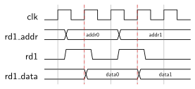
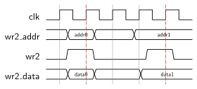
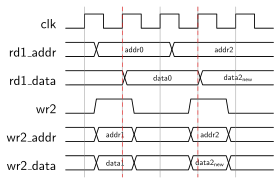
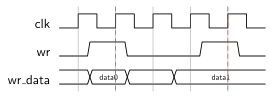
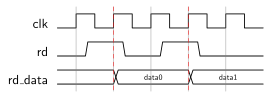

# On-Chip Memory Package
This package provides commonly used on-chip memories in the from of random access memories (RAMs) and first-in first-out buffers (FIFOs).


[[_TOC_]]

## Required Files

- [dp_ram_1c1r1w.vhd](src/dp_ram_1c1r1w.vhd)

- [dp_ram_1c1r1w_rdw.vhd](src/dp_ram_1c1r1w_rdw.vhd)

- [dp_ram_2c2rw.vhd](src/dp_ram_2c2rw.vhd)

- [dp_ram_2c2rw_byteen.vhd](src/dp_ram_2c2rw_byteen.vhd)

- [fifo_1c1r1w.vhd](src/fifo_1c1r1w.vhd)

- [fifo_1c1r1w_fwft.vhd](src/fifo_1c1r1w_fwft.vhd)

- [mem_pkg.vhd](src/mem_pkg.vhd)


## Overview

Important components in nearly every integrated circuit are memories.
If storage with full access speed is required, only on-chip memories are viable options.


This package provides various on-chip memory modules, with different access strategies:

- `dp_ram_1c1r1w`: a single-clock simple dual-port RAM with one read and one write port
- `dp_ram_1c1r1w_rwd`: a single-clock simple dual-port RAM with one read and one write port with New Data Read-During-Write behavior
- `dp_ram_2c2rw`: a dual-clock true dual-port RAM with two read/write ports
- `dp_ram_2c2rw_byteen`: a dual-clock true dual-port RAM with byte-enable control singals
- `fifo_1c1r1w`: a classic FIFO with one read and one write port
- `fifo_1c1r1w_fwft`: a classic FIFO with one read and one write port and first word fall through (FWFT) behavior


## Components

### dp_ram_1c1r1w
The `dp_ram_1c1r1w` (1 clock 1 read 1 write) is a simple dual-port RAM, enabling simultaneous read and write operations with a single clock.


```vhdl
entity dp_ram_1c1r1w is
	generic (
		ADDR_WIDTH : positive; -- Address bus width
		DATA_WIDTH : positive  -- Data bus width
	);
	port (
		clk    : in  std_ulogic; -- Connection for the clock signal.

		-- Read port
		rd1_addr : in  std_ulogic_vector(ADDR_WIDTH - 1 downto 0);
		rd1_data : out std_ulogic_vector(DATA_WIDTH - 1 downto 0) := (others=>'0');
		rd1      : in  std_ulogic;

		-- Write port
		wr2_addr : in  std_ulogic_vector(ADDR_WIDTH - 1 downto 0);
		wr2_data : in  std_ulogic_vector(DATA_WIDTH - 1 downto 0);
		wr2      : in  std_ulogic
	);
end entity;
```


#### Interface

The size of the memory is defined by the generics `ADDR_WIDTH` and `DATA_WIDTH`.
It has 2^`ADDR_WITDH` memory location storing `DATA_WIDTH` bits each.
Hence, the total number of bits that can be stored is 2^`ADDR_WITDH`*`DATA_WIDTH`.

A standard synchronous memory access protocol is used for accessing the RAM.
At any rising edge of the `clk` signal, when the `rd1` signal is high, the data word stored at the address `rd1_addr` is written to the `rd1_data` port.




At any rising edge of the `clk` signal, when the `wr2` signal is high, the data word at `wr2_data` is written to address `wr2_addr`.





#### Implementation

The implementation follows the Intel design recommendations for a [Single-Clock Synchronous RAM with Old Data Read-During-Write Behavior](https://www.intel.com/content/www/us/en/docs/programmable/683082/21-3/single-clock-synchronous-ram-with-old.html).


### dp_ram_1c1r1w_rdw
The `dp_ram_1c1r1w_rdw` (1 clock 1 read 1 write) is a single-clock simple dual-port synchronous RAM with New Data Read-During-Write behavior.


```vhdl
entity dp_ram_1c1r1w_rdw is
	generic (
		ADDR_WIDTH : positive;
		DATA_WIDTH : positive
	);
	port (
		clk           : in std_ulogic;
		-- Read port
		rd1_addr      : in std_ulogic_vector(ADDR_WIDTH-1 downto 0);
		rd1_data      : out std_ulogic_vector(DATA_WIDTH-1 downto 0);

		-- Write port
		wr2_addr      : in std_ulogic_vector(ADDR_WIDTH-1 downto 0);
		wr2_data      : in std_ulogic_vector(DATA_WIDTH-1 downto 0);
		wr2           : in std_ulogic
	);
end entity;
```


#### Interface

The size of the memory is defined by the generics `ADDR_WIDTH` and `DATA_WIDTH`.
It has 2^`ADDR_WITDH` memory location storing `DATA_WIDTH` bits each.
Hence, the total number of bits that can be stored is 2^`ADDR_WITDH`*`DATA_WIDTH`.

At any rising edge of the `clk` signal the data word stored at the address `rd1_addr` is written to the `rd1_data` port.
When the `wr2` signal is high, the data word at `wr2_data` is written to address `wr2_addr`.

`wr2_data` is read at the read port `rd1_data` , whenever the two addresses `wr2_addr` and `rd1_addr` are the same during a write (`wr` asserted).

The following timing diagram illustrates this:





#### Implementation

The implementation follows the Intel design recommendations for a [Single-Clock Synchronous RAM with New Data Read-During-Write Behavior](https://www.intel.com/content/www/us/en/docs/programmable/683082/21-3/single-clock-synchronous-ram-with-new.html).


### dp_ram_2c2rw
The `dp_ram_2c2rw` (2 clocks 2 read/write ) is a dual-clock RAM with two independent read/write ports.


```vhdl
entity dp_ram_2c2rw is
	generic (
		ADDR_WIDTH : positive;
		DATA_WIDTH : positive
	);
	port (
		clk1 : in  std_ulogic;
		clk2 : in  std_ulogic;

		-- Read/write port 1
		rw1_addr    : in  std_ulogic_vector(ADDR_WIDTH-1 downto 0);
		rw1_rd_data : out std_ulogic_vector(DATA_WIDTH-1 downto 0) := (others=>'0');
		rw1_rd      : in  std_ulogic;
		rw1_wr_data : in  std_ulogic_vector(DATA_WIDTH-1 downto 0);
		rw1_wr      : in  std_ulogic;

		-- Read/write port 2
		rw2_addr    : in  std_ulogic_vector(ADDR_WIDTH-1 downto 0);
		rw2_rd_data : out std_ulogic_vector(DATA_WIDTH-1 downto 0) := (others=>'0');
		rw2_rd      : in  std_ulogic;
		rw2_wr_data : in  std_ulogic_vector(DATA_WIDTH-1 downto 0);
		rw2_wr      : in  std_ulogic
	);
end entity;
```


#### Interface

`ADDR_WIDTH` and `DATA_WIDTH` are generics defining the size of the address and data buses respectively, with a memory size of 2^`ADDR_WIDTH` locations each storing `DATA_WIDTH` bits.

Note that the difference between a memory with one read and one write port (see `dp_ram_1c1r1w`) and a memory with one read/write port is that, the former has dedicated and independed address inputs for both the read and write port, whereas there is only one address input for the read/write port.

Additionally, the `dp_ram_2c2rw` RAM operates with two separate clocks (`clk1` and `clk2`), each controlling an independent read/write port.

Each port supports both reading and writing operations:
- Port 1 operates on `clk1`, facilitating read and write actions as dictated by the control signals `rw1_rd` and `rw1_wr`.
- Port 2 operates on `clk2`, similarly handling data transactions under the control of `rw2_rd` and `rw2_wr`.


#### Implementation

The implementation follows the Intel design recommendations for [True Dual-Port Synchronous RAM](https://www.intel.com/content/www/us/en/docs/programmable/683082/21-3/true-dual-port-synchronous-ram.html).


### dp_ram_2c2rw_byteen
The `dp_ram_2c2rw_byteen` (2 clocks 2 read/write with byte enable) is a dual-clock RAM with two independent read/write ports and incorporates byte-enable controls for each data byte.


```vhdl
entity dp_ram_2c2rw_byteen is
	generic (
		ADDR_WIDTH : positive;
		DATA_WIDTH : positive
	);
	port (
		clk1 : in  std_ulogic;
		clk2 : in  std_ulogic;

		-- Read/write port 1
		rw1_addr    : in  std_ulogic_vector(ADDR_WIDTH-1 downto 0);
		rw1_rd_data : out std_ulogic_vector(DATA_WIDTH-1 downto 0) := (others=>'0');
		rw1_rd      : in  std_ulogic;
		rw1_wr_data : in  std_ulogic_vector(DATA_WIDTH-1 downto 0);
		rw1_wr_ben  : in  std_ulogic_vector(DATA_WIDTH/8-1 downto 0);
		rw1_wr      : in  std_ulogic;

		-- Read/write port 2
		rw2_addr    : in  std_ulogic_vector(ADDR_WIDTH-1 downto 0);
		rw2_rd_data : out std_ulogic_vector(DATA_WIDTH-1 downto 0) := (others=>'0');
		rw2_rd      : in  std_ulogic;
		rw2_wr_data : in  std_ulogic_vector(DATA_WIDTH-1 downto 0);
		rw2_wr_ben  : in  std_ulogic_vector(DATA_WIDTH/8-1 downto 0);
		rw2_wr      : in  std_ulogic
	);
begin
	assert DATA_WIDTH = 2**log2c(DATA_WIDTH) report "DATA_WIDTH must be a power of 2!" severity failure;
end entity;
```


#### Interface

`ADDR_WIDTH` and `DATA_WIDTH` define the addressable memory size and the width of data in bits, respectively.
The memory is organized such that each byte within the `DATA_WIDTH` can be individually written to, using the byte-enable signals
(`rw1_wr_ben` for Port 1 and `rw2_wr_ben` for Port 2).

The RAM operates with two separate clocks (`clk1` and `clk2`), each controlling an independent port (see `dp_ram_2c2rw`).
Each port supports reading and writing operations, with the write operations being selectively controlled by the byte-enable signals.

The `rw{1|2}_wr_ben` signals are `DATA_WIDTH/8`-wide, with each bit corresponding to a byte of the data signal `rw{1|2}_wr_data`.
When a bit is high, the corresponding byte is written to the memory location.
The LSB of the data signal corresponds to the lowest byte address.
Respectively, the MSB of the data signal corresponds to the highest byte address.


#### Implementation

One `dp_ram_2c2rw` per byte of the data signals is instantiated.
The `rw{1|2}_wr` signals are logically ANDed with the corresponding `rw{1|2}_wr_ben` signals to enable byte-wise writing.


### fifo_1c1r1w
The `fifo_1c1r1w` (1 clock 1 read 1 write) is a single-clock FIFO (first-in first-out) that manages data flow with customizable depth and data width.


```vhdl
entity fifo_1c1r1w is
	generic (
		DEPTH  : positive;
		DATA_WIDTH : positive
	);
	port (
		clk       : in  std_ulogic;
		res_n     : in  std_ulogic;

		rd_data   : out std_ulogic_vector(DATA_WIDTH - 1 downto 0);
		rd        : in  std_ulogic;

		wr_data   : in  std_ulogic_vector(DATA_WIDTH - 1 downto 0);
		wr        : in  std_ulogic;

		empty     : out std_ulogic;
		full      : out std_ulogic;
		half_full : out std_ulogic
	);
begin
	assert DEPTH = 2**log2c(DEPTH) report "DEPTH must be a power of two!" severity failure;
end entity;
```


#### Interface

Generics `DEPTH` and `DATA_WIDTH` specify the FIFO's capacity and the size of each data element respectively.
`DEPTH` has to be a power of 2 and determines the number of elements the FIFO can store, while `DATA_WIDTH` defines the width of each data element in bits.

The FIFO operates with a single clock (`clk`) and an active low reset (`res_n`).
The interface includes `rd_data` for outputting data on read operations, `wr_data` for inputting data on write operations,
and control signals `rd` and `wr` to initiate read and write actions.
Status signals `empty`, `full`, and `half_full` indicate the FIFO's state, affecting how read and write operations are handled:

- Asserting `rd` reads data if the FIFO is not empty, reflected by `empty` being low. When empty, the output is undefined.
- Asserting `wr` writes data into the FIFO if it is not full, indicated by `full` being low. Writes are ignored if the FIFO is full.
- The FIFO asserts `half_full` when it reaches half its designated capacity.

These operations are visualized in timing diagrams that show how data transitions occur and status signals are updated:

- Writing to the FIFO:




- Reading from the FIFO:



- `empty` flag behavior:


- `full` flag behavior:


#### Implementation

The FIFO uses an internal dual-pointer system to manage its read and write operations, leveraging a `dp_ram_1c1r1w` for data storage.
Pointer management and status signal updates are handled within synchronous processes tied to the rising edge of `clk`, ensuring that operations on the FIFO maintain data integrity and respect flow control constraints.


### fifo_1c1r1w_fwft
The `fifo_1c1r1w_fwft` (1 clock 1 read 1 write with First Word Fall Through behavior) is designed to streamline data handling by allowing the first word written to be immediately available at the output.


```vhdl
entity fifo_1c1r1w_fwft is
	generic (
		DEPTH  : positive;
		DATA_WIDTH : positive
	);
	port (
		clk       : in  std_ulogic;
		res_n     : in  std_ulogic;

		rd_data   : out std_ulogic_vector(DATA_WIDTH - 1 downto 0);
		rd_ack    : in  std_ulogic;
		rd_valid  : out std_ulogic;

		wr_data   : in  std_ulogic_vector(DATA_WIDTH - 1 downto 0);
		wr        : in  std_ulogic;
		full      : out std_ulogic;
		half_full : out std_ulogic
	);
end entity;
```


#### Interface

The `fifo_1c1r1w_fwft` operates like standard the single-clock architecture (see `fifo_1c1r1w_fwft`) but introduces enhanced read behavior.
The FIFO is characterized by its `DEPTH` and `DATA_WIDTH` parameters, defining its storage capacity and the width of data respectively.

The FIFO's operation is governed by a single clock (`clk`) and an active low reset (`res_n`).
The write behavior is just like `fifo_1c1r1w`'s': Data is written to the FIFO via the `wr_data` port when the write enable signal (`wr`) is asserted.
The `full` signal indicates whether the FIFO can accept more data, and the `half_full` signal is asserted when the FIFO reaches half of its storage capacity.

This FIFO has the `rd_valid` output, which replaces the typical `empty` signal to indicate the presence of valid data at the `rd_data` output.
Data becomes immediately available at `rd_data` as soon as it is written, and remains accessible until it is explicitly acknowledged by asserting the `rd_ack` signal.
This acknowledgment mechanism ensures that once data is read and acknowledged, `rd_valid` is updated to reflect the current data status, either by presenting the next available word or indicating that the FIFO is empty.

The read protocol is visualized in the timing diagram below:


The name for the read behavior of this FIFO comes from the fact, that no interaction is necessary to retrieve the first data value of the FIFO, i.e., it simply "falls through" the FIFO.


#### Implementation

Internally the `fifo_1c1r1w_fwft` instantiates a `fifo_1c1r1w` and adds some simple logic to support FWFT behavior.
The implementation includes additional control logic that manages the `rd_valid` and `rd_data` outputs, ensuring immediate availability of the first written data.
This control logic coordinates the output based on data presence and acknowledgment, adhering to the First Word Fall Through protocol.


[Return to main page](../../README.md)
