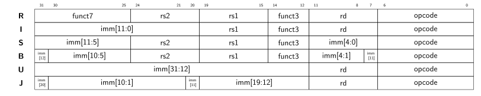
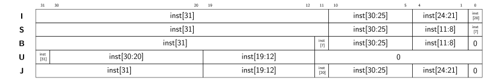

# RISC-V Core Package
The `rv_core_pkg` contains useful types, constants and subprograms for implementing processor cores supporting the RISC-V ISA.
Since all processor cores in this lecture have to support all instructions of the [RV32I Base Integer Instruction Set](https://github.com/riscv/riscv-isa-manual/releases/download/Ratified-IMAFDQC/riscv-spec-20191213.pdf), this package restricts itself to this particular instruction set as well.
Exceptions are memory ordering instructions (e.g., fence) and environment call and breakpoint instructions, which can be implemented as a *nop* (no operation) are not further supported.


[[_TOC_]]

## Required Files

- [`rv_core_pkg.vhd`](src/rv_core_pkg.vhd)


## Overview

The RV32I is a 32-bit ISA, where data words consist of four (8-bit) bytes.
Note that RISC-V is a load-store architecture, where memory is addressed as bytes using little-endian ordering.
This means that the least significant byte is stored at the lowest memory address (e.g., the hexadecimal number `0x1234` is stored as `0x34 0x12`).
However, external memories might use a different type of addressing than the processor does!


### Programmer-Visible Registers

The architecture contains 32 general-purpose registers, each is 32 bits wide.
While the registers can essentially be used for arbitrary purposes, the following convention is typically used:

| Register | ABI Name |    Description     | Saver |
| -------- | -------- | ------------------ | ----- |
| x0       | zero     | Hard-wired zero    | - |
| x1       | ra       | Return address     | Caller |
| x2       | sp       | Stack pointer      | Callee |
| x3       | gp       | Global pointer     | - |
| x4       | tp       | Thread pointer     | - |
| x5-7     | t0-2     | Temporaries        | Caller |
| x8       | s0/fp    | Saved register / frame pointer     | Callee |
| x9       | s1       | Saved register     | Callee |
| x10-11   | a0-1     | Function arguments / return values| Caller |
| x12-17   | a2-7     | Function arguments | Caller |
| x18-27   | s2-11    | Saved registers    | Callee |
| x28-31   | t3-6     | Temporaries        | Caller |

Note that the register 0 (x0) is **hard-wired** to zero.
This means that it is not just the zero register due to convention, but it is also incapable of holding anything else than 0 by construction.

Furthermore, the processor requires an internal 32-bit register, called the *program counter* (`pc`), which holds the address of the current instruction.
The program counter is automatically incremented after each instruction (except where the `pc` is set otherwise, see the instruction table further below).
Initially, after the processor is reset, it starts by reading the instruction at address 0 of the instruction memory.

**Note**: The program counter holds a byte-address (since the RISC-V uses byte-addresses), whereas the instruction memory might use a different type of addressing.
For example, if the instruction memory is word-addressed, the lowest two bits of the program counter (which are always zero anyway) are not used to address the instruction memory.
Furthermore, as RISC-V uses little-endian byte ordering, care must be taken that the individual bytes of the instruction word are in correct order for further use by the processor.
You can find more details on this for our particular environment, in [rv_sys](../rv_sys/doc.md).


### Instruction Set

Our minimal RISC-V processor architecture supports six different instruction formats, shown in the figure below.



The field `rd` denotes the destination register while `rs1` and `rs2` refer to the two source registers.
However, not all instruction formats use all of these fields.
The `opcode` field determines the operation performed by the processor when executing the respective instruction.
The table below lists the supported opcodes.

| opcode | Type |
| ------ | ---- |
| 0000011 | OPCODE_LOAD |
| 0100011 | OPCODE_STORE|
| 1100011 | OPCODE_BRANCH |
| 1100111 | OPCODE_JALR |
| 1101111 | OPCODE_JAL |
| 0010011 | OPCODE_OP_IMM |
| 0110011 | OPCODE_OP |
| 0010111 | OPCODE_AUIPC |
| 0110111 | OPCODE_LUI |
| 1110011 | OPCODE_SYSTEM |

The field `imm` denotes the *immediate*, a constant valuee mbedded directly in the instruction and used during its execution.


The table below lists all the instructions that have to be supported.
An entry of `-` denotes an arbitrary value.
The `Fmt` field holds the type of instruction format, which is important for determining an instruction's immediate.
The `Syntax` fields shows how the instruction can be written in the processor's assembly language.
Finally, the `Semantics` column defines the operational semantics using in C-style syntax extended by the following symbols:

Please note that the `imm` value in the `Semantics` column refers to the value used in the respective assembly instruction in the `Syntax` column.
As an example, consider the assembly instruction `lui ra,0x12345` (load upper immediate), which is encoded as `0x123450b7` and writes the 32-bit value `0x12345000` to register `x1/ra`.


| Symbol | Semantic |
| ------ | -------- |
| $\emptyset$ | Unsigned or zero-extended value |
| $\pm$ | Signed or sign-extended value |
| $\texttt{r}_{a:b}$ | Bits $a$ to $b$ of register $\texttt r$ |
| $\texttt{DMEM[a]}$ | Value at memory address $a$ |

Note that `shamt` (*shift amount*) is used instead of `imm[4:0]` for shift operations.


| Opcode    | Funct3 | Funct7 | Fmt | Syntax           | Semantics |
| ------    | ------ | ------ | --- | ---------------- | --------- |
| OPCODE_LUI   |   -    |    -   |  U  | **LUI rd,imm**      | $\mathtt{rd=imm^\pm\lt\lt 12}$ |
| OPCODE_AUIPC |   -    |    -   |  U  | **AUIPC rd,imm**    | $\mathtt{rd=pc+(imm^\pm\lt\lt12)}$ |
| OPCODE_JAL   |   -    |    -   |  J  | **JAL rd,imm**      | $\mathtt{rd=pc+4; pc=pc+(imm^\pm\lt\lt1)}$ |
| OPCODE_JALR  |   000  |    -   |  I  | **JALR rd,rs1,imm** | $\mathtt{rd=pc+4; pc=imm^\pm+rs1; pc[0]= 0}$ |
| | | | | |
| OPCODE_BRANCH |   000  |    -   |  B  | **BEQ rs1,rs2,imm** | $\mathtt{if(rs1==rs2)\ pc=pc+(imm^\pm\lt\lt1)}$ |
| OPCODE_BRANCH |   001  |    -   |  B  | **BNE rs1,rs2,imm** | $\mathtt{if(rs1\ !\!=rs2)\ pc=pc+(imm^\pm\lt\lt1)}$ |
| OPCODE_BRANCH |   100  |    -   |  B  | **BLT rs1,rs2,imm** | $\mathtt{if(rs1^\pm\lt rs2^\pm)\ pc=pc+(imm^\pm\lt\lt1)}$ |
| OPCODE_BRANCH |   101  |    -   |  B  | **BGE rs1,rs2,imm** | $\mathtt{if(rs1^\pm\gt=rs2^\pm)\ pc=pc+(imm^\pm\lt\lt1)}$ |
| OPCODE_BRANCH |   110  |    -   |  B  | **BLTU rs1,rs2,imm** | $\mathtt{if(rs1^\emptyset\lt rs2^\emptyset)\ pc=pc+(imm^\pm\lt\lt1)}$ |
| OPCODE_BRANCH |   111  |    -   |  B  | **BGEU rs1,rs2,imm** | $\mathtt{if(rs1^\emptyset\gt =rs2^\emptyset)\ pc=pc+(imm^\pm\lt\lt1)}$ |
| | | | | |
| OPCODE_LOAD   |   000  |    -   |  I  | **LB rd,imm(rs1)**  | $\mathtt{rd=(int8\_t)\ DMEM[rs1+imm^\pm]}$ |
| OPCODE_LOAD   |   001  |    -   |  I  | **LH rd,imm(rs1)**  | $\mathtt{rd=(int16\_t)\ DMEM[rs1+imm^\pm]}$ |
| OPCODE_LOAD   |   010  |    -   |  I  | **LW rd,imm(rs1)**  | $\mathtt{rd=(int32\_t)\ DMEM[rs1+imm^\pm]}$ |
| OPCODE_LOAD   |   100  |    -   |  I  | **LBU rd,imm(rs1)** | $\mathtt{rd=(uint8\_t)\ DMEM[rs1+imm^\pm]}$ |
| OPCODE_LOAD   |   101  |    -   |  I  | **LHU rd,imm(rs1)** | $\mathtt{rd=(uint16\_t)\ DMEM[rs1+imm^\pm]}$ |
| | | | | |
| OPCODE_STORE |   000  |    -   |  S  | **SB rs2,imm(rs1)** | $\mathtt{DMEM[rs1+imm^\pm]=rs2_{7:0}}$ |
| OPCODE_STORE |   001  |    -   |  S  | **SH rs2,imm(rs1)** | $\mathtt{DMEM[rs1+imm^\pm]=rs2_{15:0}}$ |
| OPCODE_STORE |   010  |    -   |  S  | **SW rs2,imm(rs1)** | $\mathtt{DMEM[rs1+imm^\pm]=rs2}$ |
| | | | | |
| OPCODE_OP_IMM |   000  |    -   |  I  | **ADDI rd,rs1,imm** | $\mathtt{rd=rs1+imm^\pm}$ |
| OPCODE_OP_IMM |   010  |    -   |  I  | **SLTI rd,rs1,imm** | $\mathtt{rd=(rs1^\pm\lt imm^\pm)\ ?\ 1 : 0}$ |
| OPCODE_OP_IMM |   011  |    -   |  I  | **SLTIU rd,rs1,imm** | $\mathtt{rd=(rs1^\emptyset\lt(imm^\pm)^\emptyset)\ ?\ 1 : 0}$ |
| OPCODE_OP_IMM |   100  |    -   |  I  | **XORI rd,rs1,imm** | $\mathtt{rd=rs1\ ^\wedge{} \ imm^\pm}$ |
| OPCODE_OP_IMM |   110  |    -   |  I  | **ORI rd,rs1,imm** | $\mathtt{rd=rs1\ \mid\ imm^\pm}$ |
| OPCODE_OP_IMM |   111  |    -   |  I  | **ANDI rd,rs1,imm** | $\mathtt{rd=rs1\ \&\ imm^\pm}$ |
| OPCODE_OP_IMM |   001  |    -   |  I  | **SLLI rd,rs1,shamt** | $\mathtt{rd=rs1\lt\lt shamt}$ |
| OPCODE_OP_IMM |   101  | -      |  I  | **SRLI rd,rs1,shamt** | $\mathtt{rd=rs1^\emptyset\gt\gt shamt}$ |
| OPCODE_OP_IMM |   101  | -      |  I  | **SRAI rd,rs1,shamt** | $\mathtt{rd=rs1^\pm\gt\gt shamt}$ |
| | | | | |
| OPCODE_OP |   000  | 0000000 |  R  | **ADD rd,rs1,rs2** | $\mathtt{rd=rs1+rs2}$ |
| OPCODE_OP |   000  | 0100000 |  R  | **SUB rd,rs1,rs2** | $\mathtt{rd=rs1-rs2}$ |
| OPCODE_OP |   001  | 0000000 |  R  | **SLL rd,rs1,rs2** | $\mathtt{rd=rs1\lt\lt rs2_{4:0}}$ |
| OPCODE_OP |   010  | 0000000 |  R  | **SLT rd,rs1,rs2** | $\mathtt{rd=(rs1^\pm\lt rs2^\pm)\ ?\ 1 : 0}$ |
| OPCODE_OP |   011  | 0000000 |  R  | **SLTU rd,rs1,rs2** | $\mathtt{rd=(rs1^\emptyset\lt rs2^\emptyset)\ ?\ 1 : 0}$ |
| OPCODE_OP |   100  | 0000000 |  R  | **XOR rd,rs1,rs2** | $\mathtt{rd=rs1\ ^\wedge{}\ rs2}$ |
| OPCODE_OP |   101  | 0000000 |  R  | **SRL rd,rs1,rs2** | $\mathtt{rd=rs1^\emptyset\gt\gt rs2_{4:0}}$ |
| OPCODE_OP |   101  | 0100000 |  R  | **SRA rd,rs1,rs2** | $\mathtt{rd=rs1^\pm\gt\gt rs2_{4:0}}$ |
| OPCODE_OP |   110  | 0000000 |  R  | **OR rd,rs1,rs2**  | $\mathtt{rd=rs1\mid rs2}$ |
| OPCODE_OP |   111  | 0000000 |  R  | **AND rd,rs1,rs2** | $\mathtt{rd=rs1\ \&\ rs2}$ |
| | | | | |
| OPCODE_FENCE | 000 |  - |  I  | **FENCE** | $\mathtt{nop}$ |

The operational semantics of the `SLTIU` instruction requires an additional comment.
The immediate is first sign-extended and the resulting value is treated as unsigned for the comparison.

You might have noticed that the `SRLI` and `SRAI` instructions use the same `opcode` and `funct3` values.
To distinguish them, the value of `imm[10]` is used to distinguish them, since `I`-type instructions do not contain a `funct7` field.
A value of `imm[10]=0` results in an `SRLI` instruction being executed, `imm[10]=1` in an `SRAI` instruction.

Further, note that `pc` corresponds to the byte-address of the **currently** executed instruction.


As shown by the table above, there are multiple different ways how the `imm` value encoded in an instruction is converted to a 32-bit value, which is then used during the execution of the respective instruction.
The figure below summarizes this process in a compact form and shows how the actual (properly sign-extended) 32-bit immediate value is extracted from the individual bits of an instruction, depending on its format.
Although the calculation and the placement of the individual `imm` bits in the instructions formats seems awkward at first glance, it is designed to minimize the number of multiplexers for each bit.




**Note**: The `nop` instruction is a so called pseudo-instruction.
By convention, it is encoded as an `ADDI x0,x0,0` instruction, which corresponds to the 32-bit word `0x00000013`.


## Types and Constants
-   ```vhdl
    constant BYTE_WIDTH        : positive := 8;
    constant DATA_WIDTH        : positive := 32;
    constant BYTEEN_WIDTH      : positive := DATA_WIDTH/BYTE_WIDTH;
    ```
    
    These constants define some basic bit widths in the context of the RV ISA.
    
---


-   ```vhdl
    subtype data_t  is std_ulogic_vector(DATA_WIDTH-1 downto 0);
    subtype instr_t is std_ulogic_vector(WIDTH_INSTRUCTION-1 downto 0);
    ```
    
    These two subtypes can be used for all data, respectively instruction, words in the context of the RV ISA, thus improving the readability and maintainability of RV implementations.
    
---


-   ```vhdl
    constant WIDTH_OPCODE      : natural := 7;
    constant INDEX_OPCODE      : natural := 0;
    ```
    
    
    
---


-   ```vhdl
    subtype opcode_t      is std_ulogic_vector(WIDTH_OPCODE-1 downto 0);
    ```
    
    The `rv_core_pkg` declares `WIDTH_` and `INDEX_` constants for the bit widths of fields of a 32-bit RISC-V instruction, respectively their positions within the instructions.
    Furthermore, subtypes are declared that can be used to hold values of the various fields.
    For example: the `WIDTH_OPCODE`, `INDEX_OPCODE` constants contain the information that the opcode of an instruction starts at bit 0 and consists of 7 bits.
    
    
---


-   ```vhdl
    constant OPCODE_LOAD   : opcode_t := "0000011";
    ```
    
    The various `OPCODE_` constants hold the corresponding opcode defined in the RISC-V ISA.
    For example, the `OPCODE_LOAD` holds the "0000011" opcode defined for LOAD instructions.
    
    
---


-   ```vhdl
    constant FUNCT7_EXT_M  : funct7_t := "0000001";
    constant FUNCT3_MUL    : funct3_t := "000";
    ```
    
    These constants hold the `funct7` respectively `funct7` values defined in the specification of the RISC-V [M-extension](https://five-embeddev.com/riscv-user-isa-manual/Priv-v1.12/m.html) for distinguishing between it and other `OP` instructions.
    
    
---


-   ```vhdl
    constant REG_COUNT : positive      := 2**WIDTH_REG_ADDRESS;
    ```
    
    Amount of registers specified by the RV ISA.
    
---


-   ```vhdl
    constant ZERO_REG  : reg_address_t := (others => '0');
    ```
    
    Address of the zero register, i.e., `x0`.
    
---


-   ```vhdl
    constant ZERO_DATA : data_t        := (others => '0');
    ```
    
    Zero data word.
    
---


-   ```vhdl
    type instr_format_t is (
    	FORMAT_U,
    	FORMAT_J,
    	FORMAT_I,
    	FORMAT_B,
    	FORMAT_S,
    	FORMAT_R,
    	FORMAT_INVALID
    );
    ```
    
    Enumeration type for the different instruction formats.
    


## Subprograms
-   ```vhdl
    function get_opcode (instr : instr_t) return opcode_t;
    ```
    
    The various `get_*` functions declared in the `rv_core_pkg` can be used to extract the respective field from a 32-bit RISC-V instruction.
    For example, the `get_opcode` function takes an instruction and returns its opcode.
    Apart from the opcode functions for extracting `rd`, `rs1`, `rs2`, `funct3`, and `funct7` are available.
    
    
---


-   ```vhdl
    function opcode_to_string(opcode : opcode_t) return string;
    function to_string(fmt : instr_format_t) return string;
    ```
    
    The `opcode_to_string`function and the overload of the `to_string` function for ìnstr_format_t` return a string representation of the respective `opcode_t` / `instr_format_t` value.
    
    


[Return to main page](../../README.md)
