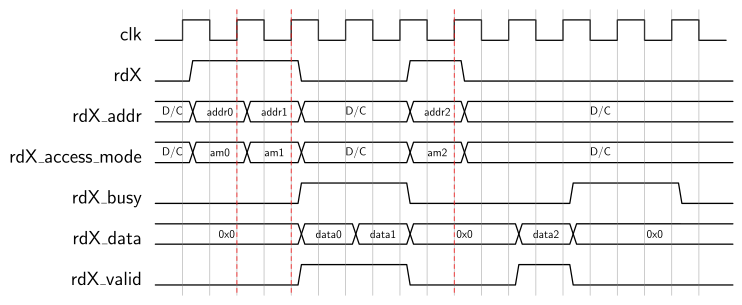
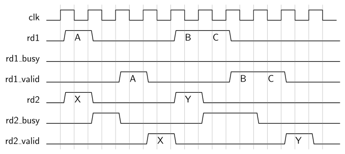

# SRAM Controller Package
The `sram_ctrl_pkg` provides an interface controller, `sram_ctrl`, to the DE2-115's [IS61WV102416BLL](https://www.issi.com/WW/pdf/61WV102416ALL.pdf) SRAM chip.


[[_TOC_]]

## Required Files

- [IS61WV102416BLL.vhd](src/IS61WV102416BLL.vhd)

- [sram_ctrl.vhd](src/sram_ctrl.vhd)

- [sram_ctrl_arch_ref.vhd](src/sram_ctrl_arch_ref.vhd)

- [sram_ctrl_pkg.vhd](src/sram_ctrl_pkg.vhd)

## Components

### sram_ctrl
The `sram_ctrl` module abstracts away the hardware details of the IS61WV102416BLL chip and provides two mixed-priority read ports and one buffered write port that are byte-addressable and, to some extent, independent interfaces to this memory.


```vhdl
component sram_ctrl is
	generic (
		ADDR_WIDTH  : positive := 21;
		DATA_WIDTH  : positive := 16;
		WR_BUF_SIZE : positive := 8
	);
	port (
		clk : in std_ulogic;
		res_n : in std_ulogic;

		-- write port (buffered)
		wr_addr        : in  std_ulogic_vector(ADDR_WIDTH-1 downto 0);
		wr_data        : in  std_ulogic_vector(DATA_WIDTH-1 downto 0);
		wr             : in  std_ulogic;
		wr_access_mode : in  sram_access_mode_t;
		wr_empty       : out std_ulogic;
		wr_full        : out std_ulogic;
		wr_half_full   : out std_ulogic;

		-- read port 1 (high priority)
		rd1_addr        : in  std_ulogic_vector(ADDR_WIDTH-1 downto 0);
		rd1             : in  std_ulogic;
		rd1_access_mode : in  sram_access_mode_t;
		rd1_busy        : out std_ulogic;
		rd1_data        : out std_ulogic_vector(DATA_WIDTH-1 downto 0);
		rd1_valid       : out std_ulogic;

		-- read port 2 (low priority)
		rd2_addr        : in  std_ulogic_vector(ADDR_WIDTH-1 downto 0);
		rd2             : in  std_ulogic;
		rd2_access_mode : in  sram_access_mode_t;
		rd2_busy        : out std_ulogic;
		rd2_data        : out std_ulogic_vector(DATA_WIDTH-1 downto 0);
		rd2_valid       : out std_ulogic;

		-- external interface to SRAM
		sram_dq   : inout std_logic_vector(DATA_WIDTH-1 downto 0);
		sram_addr :   out std_ulogic_vector(ADDR_WIDTH-2 downto 0);
		sram_ub_n :   out std_ulogic;
		sram_lb_n :   out std_ulogic;
		sram_we_n :   out std_ulogic;
		sram_ce_n :   out std_ulogic;
		sram_oe_n :   out std_ulogic
	);
end component;
```


#### Interface

`clk` is the clock input, `res_n` an asynchronous, active-low reset.
The generics `ADDR_WIDTH` and `DATA_WIDTH` allow specifying the bit widths of the **byte** memory address and of the addressable SRAM memory locations.
However, for the DE2-115's SRAM containing $2^{20}$ 16-bit words, the address width will be 21 (because there are $2^{21}$ bytes) and the data width 16 (the SRAM consists of 16-bit long words).
An entity-level assertion enforces that `DATA_WIDTH=16` holds.
The `WR_BUF_SIZE` generic allows specifying the depth of the write port's buffer.
The value of this generic must be a power of two.


As mentioned above, the `sram_ctrl` features two read and one (buffered) write port.
Note that for all three ports the applied address `*_addr` must be even for a `WORD` access (`*_access_mode`), i.e., the LSB of the address must be zero.
Unaligned word access is not allowed and the behavior of the `sram_ctrl` in such a case is **undefined**.


##### Buffered Write Port

The write port consists of the signals starting with `wr` and allows writing to the external SRAM.
Whenever `wr_full` is not set, a new write access may be issued by setting `wr` to high for exactly one clock cycle and applying the address and data of the write access via `wr_addr` and `wr_data`.
The input `wr_access_mode` specifies whether a write access is of `BYTE` or `WORD` mode.
For the `BYTE` access mode the upper 8 bits of the applied data (i.e., `wr_data(15 downto 8)`) are ignored.
The `wr_empty` and `wr_half_full` outputs are low whenever the write port's buffer is either not empty or filled above half its capacity.
In essence, the buffered write port implements a FIFO interface.

Note that due to the buffering, issued write operations might not happen immediately, but only once there are no on-going read operations.
Hence, depending on the activity at the read ports, an issued write operation may take an arbitrary long time to actually happen.
This makes the write port the lowest-priority access port of the `sram_ctrl`.


##### Read Ports

The two read ports consist of the the signals starting with `rd1` and `rd2`, respectively.
Both ports are operated identically.
In particular, whenever the `rdX_busy` signal is low, a read operation may be performed by asserting `rdX` for exactly one clock cycle.
In this cycle the desired read address and access mode must be applied to `rdX_addr` and `rdX_access_mode`, respectively.
Whenever `rdX` is low the inputs `rdX_addr` and `rdX_access_mode` can be arbitrary as they are ignored by the core.

After an arbitrary time, depending on the activity of the other ports and which read port is used, the controller provides the result of the read operation at the output `rdX_data`.
For a `BYTE` access, the top byte in `rdX_data` (i.e., `rdX_data(15 downto 0)`) is zero.
The validity of `rdX_data` is indicated by `rdX_valid` being set in the same clock cycle (and only for this clock cycle).
Hence, whenever `rdX_valid` is low, `rdX_data` is not guaranteed to provide valid data.

The timing diagram below illustrates the behavior of the read ports:




In case both `rdX_busy` signals are low and read access operations are attempted at both read ports in the same clock cycle (i.e., `rd1=rd2='1'`), read port 1 (prefix `rd1`) takes precedence.
The read operation at read port 2 will meanwhile be buffered until there is no interfering read operation at port 1.
`rd2_busy` will be asserted during this time to indicate that no new read operations must be issued at read port 2.

Therefore, reads at port 1 are always executed immediately, while reads at port 2 can be stalled for an **arbitrary** amount of time.
The read access time, i.e., the time between the assertion of `rd1` and `rd1_valid`, is always two clock cycles for reads at port 1 and *at least* two clock cycles for reads at port 2.
This behavior does effectively assign the ports a different priority, where read port 1 can be considered to have high and read port 2 to have low priority.

The timing diagram below illustrates this mixed-priority behavior of the read ports:





#### Implementation

The logic responsible for executing the buffered write operations sets the `rdX_busy` signals during a write to the SRAM in order to prevent incoming read operations to interrupt the writing.
However, writes happen one a time and not in bursts, i.e., for each distinct write access in the buffer the `sram_ctrl` first checks whether there is no pending read operation before executing the write operation.

Whenever a `rdX_valid` signal is low, the `sram_ctrl` sets the respective `rdX_data` output to the zero vector.

The `rdX_busy` signals are derived **only** from the internal state of the controller and **not** combinationally from any of its inputs!
However, the read port priorities / precedence resolve situations where both read ports are active simultaneously due to this fact.


### IS61WV102416BL
The `IS61WV102416BLL` is a **simulation** model of the DE2-115's SRAM chip.


```vhdl

```


#### Interface

The interface of the simulation model corresponds to the one of the "real" chip.
The model can therefore directly be connected to the respective signals of the `sram_ctrl`.


#### Implementation

The model supports the read cycle no.1 and write cycle no.3 of the SRAM's datasheet.
Internally it adheres to the timing characteristics of the slowest speed grade (-10).
Since the SRAM itself is essentially a black-box, the model is also very likely not a completely faithful description of the SRAM.
However, it is still useful as a first check whether an SRAM interface is implemented at least vaguely correct.


## Types and Constants

```vhdl
type sram_access_mode_t is (BYTE, WORD);
```

The `sram_access_mode_t` enumeration type is used to specify the type of memory operation, i.e., whether an access is `BYTE` (8-bit) or `WORD` (16-bit) addressed.


## Subprograms

```vhdl
function to_sul(x : sram_access_mode_t) return std_ulogic;
```

This function returns a `std_ulogic` representation of the passed `sram_access_mode_t` value. The value `WORD` is mapped to `'1'`, while `BYTE` is mapped to `'0'`


---


```vhdl
function to_sram_access_mode_t(x : std_ulogic) return sram_access_mode_t;
```

Allow conversion between values of `std_ulogic` and `sram_access_mode_t`. For a parameter value of `'1'` the value `WORD` is returned, otherwise `BYTE`.


[Return to main page](../../README.md)
