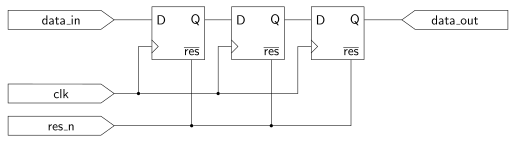
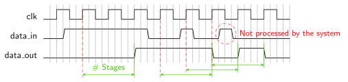

# Synchronizer Package
This package provides a synchronizer module that can be used to connect external signals (e.g., from push buttons or serial ports) to a particular clock domain.


[[_TOC_]]

## Required Files

- [sync.vhd](src/sync.vhd)

- [sync_pkg.vhd](src/sync_pkg.vhd)

## Components

### sync component
The `sync` module is a simple shift-register based waiting synchronizer.


```vhdl
component sync is
	generic(
		SYNC_STAGES : positive;
		RESET_VALUE : std_ulogic
	);
	port (
		clk       : in  std_ulogic;
		res_n     : in  std_ulogic;
		data_in   : in  std_ulogic;
		data_out  : out std_ulogic
	);
end component;
```


#### Interface

The synchronizer has no special interface protocol.
`clk` is the clock signal of the target clock domain, `res_n` is an asynchronous reset.
The signals `data_in` and `data_out` are the asynchronous input respectively synchronized output of the synchronizer.
Via the `SYNC_STAGES` generic the amount of flip-flops used for synchronization can be specified (see *Implementation* for details).
The `RESET_VALUE` generic allows configuring the synchronizer flip-flops' value directly after a reset.


#### Implementation

Internally the synchronizer simple consists of `SYNC_STAGES+1` D flip-flops connected in a chain as shown below for `SYNC_STAGES=2`:




Note that due to the structure of the synchronizer, between a change of `data_in` and a respective change of `data_out` there is a delay of up to `SYNC_STAGES+1` clock cycles. Furthermore, spikes or glitches not overlapping a rising clock edge (see example trace below) will not show up at the synchronizer output.




[Return to main page](../../README.md)
