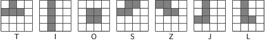
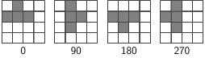
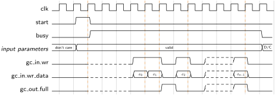
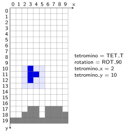
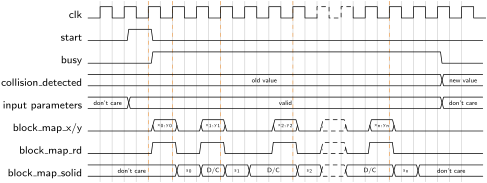
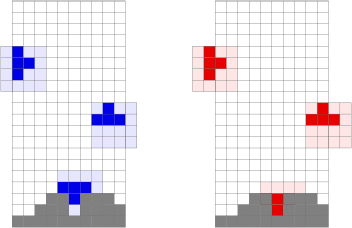

# Tetris Utility Package
The `tetris_util_pkg` package contains some utility functions and modules that deal with drawing [tetrominoes](https://en.wikipedia.org/wiki/Tetromino) (in the context of the game Tetris also the term *tetriminos* is used) and colliding them with a 2D map of blocks (and its borders).


[[_TOC_]]

## Required Files

- [tetris_util_pkg.vhd](src/tetris_util_pkg.vhd)

- [tetromino_collider.vhd](src/tetromino_collider.vhd)

- [tetromino_drawer.vhd](src/tetromino_drawer.vhd)


## Overview

A tetromino is composed of a number of blocks arranged in a 4x4 grid.
The figure below shows the 7 classic tetromino shapes, which are also referred to with the letters which they (approximately) resemble.




The package features a special datatype that is used to refer to these tetromino shapes and declares constants for each of them.
Notice that the tetrominoes are numbered according to the sequence shown in figure.
```vhdl
subtype tetromino_t is std_logic_vector(2 downto 0);
constant TET_T : tetromino_t := "000";
[...]
constant TET_L : tetromino_t := "110";
```
Tetrominoes can also be rotated (clockwise) by 90, 180 and 270 degrees, which is illustrated in the figure below.




Note that for some tetrominoes some rotation states are equivalent, e.g., an S tetromino gives the same shape when rotated by 0 or 180 degrees.
To represent a rotation, the package uses the `rotation_t` datatype and defines constants for the four possible rotation states.

```vhdl
subtype rotation_t is std_logic_vector(1 downto 0);
constant ROT_0   : rotation_t := "00";
constant ROT_90  : rotation_t := "01";
constant ROT_180 : rotation_t := "10";
constant ROT_270 : rotation_t := "11";
```
Hence every possible tetromino shape that can appear in a Tetris game is identified by a `tetromino_t` and `rotation_t` value.

To test whether a certain block in the 4x4 grid belongs to a specific tetromino with a specific rotation state, the package provides the `is_tetromino_solid_at` function.

```vhdl
function is_tetromino_solid_at(tetromino : tetromino_t; rotation : rotation_t; x, y : std_ulogic_vector(1 downto 0)) return boolean;
```
This function returns `true` if the block identified by the `x` and `y` coordinates belongs to the specified tetromino.
The coordinate system used for this purpose is shown in the figure below.


The following code shows some examples on how to use this function.

```vhdl
assert is_tetromino_solid_at(TET_T, ROT_0, "00", "00") = false;
assert is_tetromino_solid_at(TET_T, ROT_0, "01", "00") = true;
assert is_tetromino_solid_at(TET_T, ROT_0, "10", "01") = true;
```


## Components

### tetromino_drawer
The `tetromino_drawer` allows drawing of tetrominoes to a Graphics Command Interface (CGI).


```vhdl
component tetromino_drawer is
	generic (
		BLOCK_SIZE : integer
	);
	port (
		clk : in std_ulogic;
		res_n : in std_ulogic;
		start : in std_ulogic;
		busy : out std_ulogic;
		x : in signed(GFX_CMD_WIDTH-1 downto 0);
		y : in signed(GFX_CMD_WIDTH-1 downto 0);
		tetromino : in tetromino_t;
		rotation : in rotation_t;
		bmpidx : bmpidx_t;
		gci_in : out gci_in_t;
		gci_out : in gci_out_t
	);
end component;
```


#### Interface

To draw a tetromio, the relevant *input parameters* (i.e., `bmpidx`, `tetromino`, `rotation`, `x` and `y`) must be applied to the core and the `start` signal must be asserted for exactly one clock cycle.
The core will then assert the `busy` signal and keep it high as long as it is processing and/or generating graphics commands.
During this time the input parameters must not be changed and the start signal must not be asserted again.

The`tetromino_drawer` implements the [graphics command interface](../gfx_core/doc.md).
For that purpose it provides the port signals `gci_in` and `gci_out`

The `tetromino_drawer` expects that bitmap identified by `bmpidx` has a height of `BLOCK_SIZE` and that it contains at least 7 `BLOCK_SIZE` wide blocks, which will be used for the different tetromino types.
Hence, this bitmap must have a width of at least 7*`BLOCK_SIZE` pixels.

The inputs `x` and `y` define coordinate of the destination position of the tetromino in the frame buffer (i.e., the coordinate of the upper left corner of the 4x4 tetromino grid).
Note that `x` and `y` are singed numbers and essentially define the inital position the Graphics Pointer is set to.

The figure below shows an example timing diagram for the `tetromino_drawer`.
As soon as the `busy` signal is deasserted, a new drawing process can be started.





### tetromino_collider
The `tetromino_collider` can be used to check whether a given tetromino collides with a 2D map of blocks or its borders.


```vhdl
component tetromino_collider is
	generic (
		BLOCKS_X : integer;
		BLOCKS_Y : integer
	);
	port (
		clk : in std_ulogic;
		res_n : in std_ulogic;
		start : in std_ulogic;
		busy : out std_ulogic;
		collision_detected : out std_ulogic;
		tetromino_x : in signed(log2c(BLOCKS_X) downto 0);
		tetromino_y : in signed(log2c(BLOCKS_Y) downto 0);
		tetromino : in tetromino_t;
		rotation : in rotation_t;
		block_map_x : out unsigned(log2c(BLOCKS_X)-1 downto 0);
		block_map_y : out unsigned(log2c(BLOCKS_Y)-1 downto 0);
		block_map_rd : out std_ulogic;
		block_map_solid : in std_ulogic
	);
end component;
```


#### Interface

The tetromino to check tetromino is defined by signals `tetromino` and `rotation` and its targer position coordinates `tetromino_x` and `tetromino_y`.
The figure below illustrates the coordinate system that is used for this purpose.
The size of the map is defined by the generics `BLOCKS_X` and `BLOCKS_Y`.
The gray blocks in the figure indicate map positions that are occupied or solid.
If a block of a tetromio would overlap with such a position, a collision would be reported.
Hence for the shown scenario, there are no collisions.




The figure below shows an example timing diagram that demonstrates how to interface with the `tetromino_collider`.
The inputs that define the shape and position of the tetromino to be checked are referred to as \emph{input parameters}.
They include the input signals `tetromino_x`, `tetromino_y`, `tetromino` and `rotation`.
To start a collision check run, the `start` signal must be asserted for exactly one clock cycle.
The input parameters must be applied at the same time as the `start` signal and must not be changed during the whole run.
The core asserts the `busy` signal to indicate that it is processing.
A run is complete when the `busy` signal returns to low again.
The result of the collision check can then be obtained at the `collision_detected` output (low meaning that no collision was detected).

During a run, the core samples various map positions to check whether they are solid or not.
This is achieved via the signals `block_map_x`, `block_map_y`, `block_map_rd` and `block_map_solid`.
Whenever `block_map_rd` is high, the core outputs the desired map coordinates at `block_map_x` and `block_map_y` and expects an answer on whether the respective position is solid or not on the next clock signal at the signal `block_map_solid` (low indicating that the position is not solid).
At all other times the value of `block_map_solid` is ignored.
Note that `block_map_rd` will never be high for more than one cycle at a time and there may be pauses of arbitrary lengths in between consecutive requests.

The basic idea with this interface is to use the signals `block_map_x`, `block_map_y` and `block_map_rd` to access an [on-chip block RAM](../mem/doc.md) that represents the map.




Note, that the inputs `tetromino_x` and `tetromino_y` are **signed** numbers!
This is necessary to be able to place certain tetrominoes everywhere on the map.
The figure below shows some examples of tetrominoes that (i) don't produce collisions (blue) and (ii) that collide with either the borders of the map or some solid block (red).
Note that the left-most tetromino on both maps has a negative x coordinate.





[Return to main page](../../README.md)
