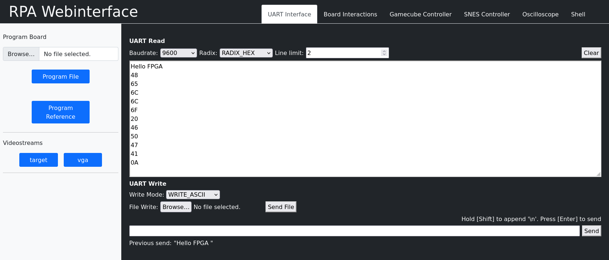

# Top Module
This library module provides you with the `top` entity declaration for your designs. Furthermore, the `dbg_top` wrapper, required for the Remote Lab functionality, is provided.


[[_TOC_]]

## Required Files

- [dbg_core.qxp](src/dbg_core.qxp) (use **only for synthesis** (i.e., in Quartus), not for simulation!)

- [dbg_top.vhd](src/dbg_top.vhd)

- [top.vhd](src/top.vhd)


## Overview

The top-level entity defines the interface of the design to the "outside world".
In DDCA this top level entity is always `dbg_top`, which acts a wrapper around the actual top-level entity used in your design (simply called `top`).

The reason for the wrapper is that the `dbg_top` entity contains the `dbg_core``, which allows us to control the design in the Remote Lab via UART.
This is necessary, as it is not possible to physically interact with the board (e.g., press buttons, flip switches) or its peripherals in the Remote Lab.
Using the `dbg_core`` we can emulate peripheral components of the top entity via a UART interface from a lab computer to an attached board.

However, for your designs you don't have to worry about this.
All you need to know is that you need to provide an architecture for `top` if you want to donwload your design to the FPGA board.


## Components

### top
This is the actual `top` entity of all your designs, providing all the signals from / to the outside world.


```vhdl
entity top is
	port (
		--50 MHz clock input
		clk : in  std_ulogic;

		-- push buttons and switches
		keys     : in std_ulogic_vector(3 downto 0);
		switches : in std_ulogic_vector(17 downto 0);

		--Seven segment displays
		hex0 : out std_ulogic_vector(6 downto 0) := (others=>'0');
		hex1 : out std_ulogic_vector(6 downto 0) := (others=>'0');
		hex2 : out std_ulogic_vector(6 downto 0) := (others=>'0');
		hex3 : out std_ulogic_vector(6 downto 0) := (others=>'0');
		hex4 : out std_ulogic_vector(6 downto 0) := (others=>'0');
		hex5 : out std_ulogic_vector(6 downto 0) := (others=>'0');
		hex6 : out std_ulogic_vector(6 downto 0) := (others=>'0');
		hex7 : out std_ulogic_vector(6 downto 0) := (others=>'0');

		-- the LEDs (green and red)
		ledg : out std_ulogic_vector(8 downto 0) := (others=>'0');
		ledr : out std_ulogic_vector(17 downto 0) := (others=>'0');

		-- GameCube controller
		gc_data : inout std_logic;

		-- SNES controller
		snes_latch : out std_logic := '0';
		snes_clk : out std_logic := '0';
		snes_data : in std_logic;

		--interface to SRAM
		sram_dq : inout std_logic_vector(15 downto 0);
		sram_addr : out std_ulogic_vector(19 downto 0) := (others=>'0');
		sram_ub_n : out std_ulogic := '0';
		sram_lb_n : out std_ulogic := '0';
		sram_we_n : out std_ulogic := '0';
		sram_ce_n : out std_ulogic := '0';
		sram_oe_n : out std_ulogic := '0';

		-- audio interface
		wm8731_xck     : out std_logic := '0';
		wm8731_sdat : inout std_logic;
		wm8731_sclk : inout std_logic;
		wm8731_dacdat  : out std_logic := '0';
		wm8731_daclrck : out std_logic := '0';
		wm8731_bclk    : out std_logic := '0';

		-- some auxiliary output for performing measurements
		aux : out std_logic_vector(15 downto 0) := (others=>'0');

		-- interface to ADV7123 and VGA connector
		vga_dac_r : out std_ulogic_vector(7 downto 0) := (others=>'0');
		vga_dac_g : out std_ulogic_vector(7 downto 0) := (others=>'0');
		vga_dac_b : out std_ulogic_vector(7 downto 0) := (others=>'0');
		vga_dac_clk : out std_ulogic := '0';
		vga_dac_sync_n : out std_ulogic := '0';
		vga_dac_blank_n : out std_ulogic := '0';
		vga_hsync : out std_ulogic := '0';
		vga_vsync : out std_ulogic := '0';

		-- interface to the character LCD (HD44780)
		char_lcd_data     : inout std_logic_vector(7 downto 0);
		char_lcd_en       : out std_logic := '0';
		char_lcd_rw       : out std_logic := '0';
		char_lcd_rs       : out std_logic := '0';
		char_lcd_on       : out std_logic := '0';
		char_lcd_blon     : out std_logic := '0';

		-- UART
		tx : out std_logic := '0';
		rx : in std_logic
	);
end entity;
```


#### Interface

`keys` and `switches` are connected to the FPGA board's respective inputs, `ledg`, `ledr` and `hex*` to the board's red, respectively green, LEDs and hex displays.
In addition to that there arethe signals required for certain external interfaces like the SNES and GameCube gamepads, the board's SRAM, the board's WM8731 audio controller, the VGA interface, as well as the interface to the character LCD controller.

A UART interface and an auxiliary output (useful for debugging / measuring via the oscilloscope) are also included.

However, the interfaces will be described in the respective tasks where they are needed.


## Remote Lab

As explained in the course introduction, the whole exercise part of the DDCA lab course can be done remotely via our *Remote Lab*.
Please run the following command on the computer from which you want to access the Remote Lab (i.e., most probably the VM).

```
pip install git+https://git.inf2.tuwien.ac.at/sw/rpatools
```

This command installs the tools `rpa_shell` and `rpa_gui`, RPA standing for Remote Place Assigner.
A tutorial on how to use the Remote Lab was part of the first meetup.
You can find the recording [here](https://tuwel.tuwien.ac.at/mod/opencast/view.php?id=2601701).


## UART Interface

As mentioned above, the `dbg_core` in the `dbg_top` design is controlled via a [UART](https://en.wikipedia.org/wiki/Universal_asynchronous_receiver-transmitter) interface.
However, notice that the `top` design also features a UART port (the signals `tx` and `rx`).
This UART port is a "virtual" one implemented by the `dbg_core`.
Hence, data send and received there actually goes through the debug interface (i.e., the `tx` and `rx` signals of the `top` design) and is wrapped in the protocol used by the `dbg_core` to communicate with the host PC.

You don't have to understand how this works.
The only important thing is that, this means that you **cannot** simply use tools like `minicom` or `GTKTerm` to send data to and receive data from your design (i.e., the `top` design).
To do that you have to use the tool `remote.py` available on all lab PCs (local and remote).
This tool allows you to send and receive data using the following commands:

To send the text `Hello FPGA`:
```bash
remote.py -u "Hello FPGA"
```

To receive data, again use the `-u` flag, but without the data argument:

```bash
remote.py -u
```

To print the received data in hexadecimal form, use the `--hex` command line flag

```bash
remote.py -u --hex
```

To further format the output you can use the `--line-limit` argument:

```bash
remote.py -u --hex --line-limit 2
```

You can also use the `--hex` command line argument when sending data.
The tool then interprets the argument has hexadecimal data.
The following commands are all equivalent, in that they all send the exact same data.

```bash
remote.py -u "Hello FPGA"
remote.py -u --hex "48656c6c6f2046504741"
remote.py -u --hex "48 65 6c 6c 6f 20 46 50 47 41"
remote.py -u --hex "48656c6c6f2046504741 # comment"
```

Be careful with leading zeros.
The following two commands are **not** equivalent.

```bash
remote.py -u --hex "0"
remote.py -u --hex "00000000"
```

The first command sends a single byte with the value zero, the the second one send four zero-bytes.
If the number of hexadecimal digits in a number is odd, an additional leading `0` is assumed.

You can also send complete files in one go, via the `--file` command line flag:
```bash
remote.py -u --file some_file
```

Each line of the input file is processed as if it were directly passed to `remote.py` via the command line.

However, all these features can also be accessed conveniently via our web interface in the *Remote Lab*.





[Return to main page](../../README.md)
