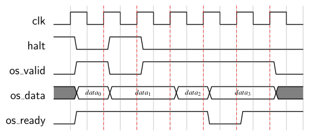

# UART Data Streamer Package
The `uart_data_streamer_pkg` provides a module implementing an 8N1 (8 data and one parity bit) [UART](https://en.wikipedia.org/wiki/Universal_asynchronous_receiver-transmitter) interface for streaming data via UART.


[[_TOC_]]

## Required Files

- [`uart_data_streamer.vhd`](src/uart_data_streamer.vhd)

- [`uart_data_streamer_pkg.vhd`](src/uart_data_streamer_pkg.vhd)

## Components

### `uart_data_streamer`
The `uart_data_streamer` module implements a 8N1 UART interface.
It allows receiving data via UART, and to buffer and provide this data via a simple handshaking scheme.
Furthermore, it also allows collecting bytes that are provided via a stream interface, and then transmitting them via UART.


```vhdl
component uart_data_streamer is
	generic (
		CLK_FREQ        : positive := 50_000_000;
		SYNC_STAGES     : positive := 2;
		IS_BUFFER_DEPTH : positive := 16;
		IS_BYTES        : positive;
		OS_BUFFER_DEPTH : positive := 16;
		OS_BYTES        : positive;
		BAUD_RATE       : positive := 9600;
		BYTE_ORDER      : BYTE_ORDER_T := BIG_ENDIAN
	);
	port (
		clk   : in std_ulogic;
		res_n : in std_ulogic;

		-- UART
		rx : in  std_ulogic;
		tx : out std_ulogic;

		-- output stream -- from rx to core
		os_valid : out std_ulogic;
		os_data  : out std_ulogic_vector(OS_BYTES * 8 - 1 downto 0);
		os_ready : in  std_ulogic;
		halt     : in  std_ulogic;

		-- input stream -- from core to tx
		is_valid : in  std_ulogic;
		is_data  : in  std_ulogic_vector(IS_BYTES * 8 - 1 downto 0);
		is_ready : out std_ulogic;
		full     : out std_ulogic
	);
end component;
```


#### Interface

The `clk` signal is the clock input, `res_n` is an asynchronous active-low reset.
Note that `CLK_FREQ` must be set to the same clock frequency as exhibited by the signal connected to the `clk` input.

The `rx` and `tx` signals are the receive and transmit transmit wires, respectively, of the UART interface, where the baud rate of this interface is defined by the `BAUD_RATE` generic.
As already stated above, the provided UART interface is 8N1, meaning that each transmission contains 8 data bits and one parity bit.
Note that `tx` might come from a different clock domain than the one of the `uart_data_streamer`.
Hence, `tx` is synchronized to `clk` using a synchronizer with `SYNC_STAGES` stages.

Furthermore, the `uart_data_streamer` features an output and an input "stream" interface, where the data received / transmitted via UART can be obtained / provided.
The interface of these two ports is described in detail in the following two sub sections.


##### Output Stream

The output data stream allows a connected module to read-in multiple bytes received by the `uart_data_streamer` via its UART interface in quick succession (if multiple bytes are available).
The data provided by the `uart_data_streamer` is provided in chunks of `OS_BYTES` byte wide vectors, and at most `OS_BUFFER_DEPTH` such chunks can be buffered inside the `uart_data_streamer` before the data at `os_data` must be consumed.

`os_valid` is asserted by the `uart_data_streamer` to signal the availability of valid consumable data on the `os_data` output.
The `os_ready` input is used by the connected module to signal that it is ready for a new value being applied at `os_data`.
This can either be when it has consumed the currently available one (i.e., when `os_valid` is set), or also when the module is "waiting" for new data (i.e., `os_valid` is low).
As a consequence, whenever `os_valid` is set, `os_data` remains accessible until `os_ready` is set as well.

The `halt` signal can be used to stall the output stream.
In essence, an asserted `halt` signal causes the `uart_data_streamer` to ignore an applied `os_ready`, resulting in `os_data` not changing while `halt` is set.

The timing diagram below illustrates the behavior of the output stream interface. Observe how `os_ready` reacts to `os_valid` within the same clock cycle (i.e., combinatorially) and how `halt` being set causes `os_data` to keep its value although `os_ready` is set (and `os_valid` is not).





##### Input Stream

The input stream interface works very similar to the output stream.
The `is_ready` signal is used to signal to a connected module that produces values that the `uart_data_streamer` is ready to receive new data.
Such a connected module can apply new data at `is_data` and signal its validity using `is_valid`, where `is_data` is a vector consisting of `IS_BYTES` bytes.

Lastly, the `full` signal indicates that the `uart_data_streamer` input stream can currently not receive any more data because its internal buffer is full.
This buffer has a capacity of `IS_BUFFER_DEPTH` `is_data` values.
When trying to send more data whenever `full` is asserted, the streamer will simply ignore incoming data packages.


##### Endianness

Note that the endianness of the `uart_data_streamer`, i.e., the byte-order used at its streaming interfaces, can be defined using the `BYTE_ORDER` generic of type `BYTE_ORDER_T`.


#### Implementation

Internally, the `uart_data_streamer` essentially consists of buffers for storing bytes that were received or are scheduled for transmission, as well as of logic to receive and transmit via UART.
The buffers are instances of the [fwft-FIFO](../mem/src/fifo_1c1r1w_fwft.vhd).
Hence, if you are confused by the streaming interfaces you might want to look at the FIFO documentation as well.
A structural overview of the `uart_data_streamer` is shown in the figure below:


The `RX Collector` is a state machine which continuously collects bytes from `rx` during UART transactions.
After receiving `OS_BYTES` (`k` in the figure) many bytes it writes the collected data bytes into the `RX FIFO`, which then makes it available to the connected module.


The `uart_data_streamer` stores data from the `is_data` input in its `TX_FIFO` when the `uart_data_streamer` is ready and the `is_valid` input is asserted, where each entry of the FIFO is `IS_BYTES` byte.
Whenever this FIFO is not empty the `TX Splitter` state machine reads a data word and splits it into bytes which are then sent out via UART on the `tx` output (lower byte first).


## Types and Constants
```vhdl
type BYTE_ORDER_T is (
	LITTLE_ENDIAN,
	BIG_ENDIAN
);
```

This enumeration type declares the different byte orders supported by the `uart_data_streamer`.


[Return to main page](../../README.md)
