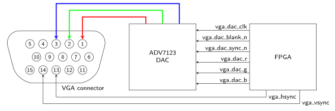
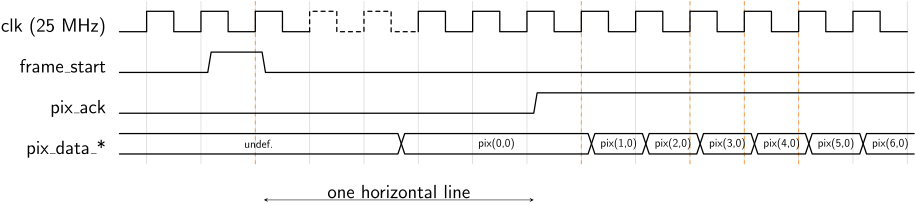
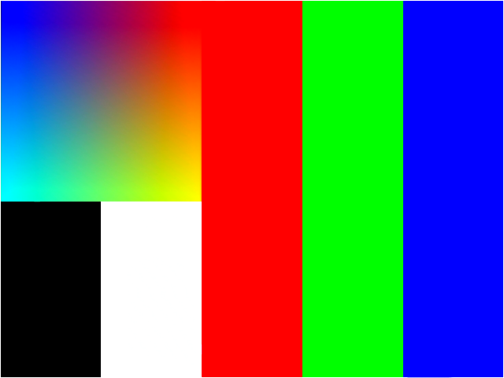

# VGA Controller
This package provides everything required to interface with the DE2115-2 board's [VGA](https://en.wikipedia.org/wiki/Video_Graphics_Array) connector and to display images on external screen. It further provides useful entities and declarations for testing / implementing VGA controllers.


[[_TOC_]]

## Required Files

- [tpg.vhd](src/tpg.vhd)

- [vga_ctrl.vhd](src/vga_ctrl.vhd)

- [vga_ctrl_pkg.vhd](src/vga_ctrl_pkg.vhd)

- [dac_dump.vhd](src/dac_dump.vhd)

- [vga_ctrl_arch_ref.vhd](src/vga_ctrl_arch_ref.vhd)

## Components

### vga_ctrl
The self-contained `vga_ctrl` library core can be directly connected to the DE2-115's VGA DAC in order to dislay images on a connected screen.


```vhdl
entity vga_ctrl is
	generic (
		H_FRONT_PORCH  : integer := 16;  -- in clk cycles
		H_BACK_PORCH   : integer := 48;  -- in clk cycles
		H_SYNC_PULSE   : integer := 96;  -- in clk cycles
		H_VISIBLE_AREA : integer := 640; -- the horizontal resolution
		V_FRONT_PORCH  : integer := 10;  -- in lines
		V_BACK_PORCH   : integer := 33;  -- in lines
		V_SYNC_PULSE   : integer := 2;   -- in lines
		V_VISIBLE_AREA : integer := 480  -- the vertical resolution
	);
	port (
		clk     : in  std_ulogic;
		res_n   : in  std_ulogic;

		-- internal interface
		frame_start : out std_ulogic;
		pix_color   : in vga_pixel_color_t;
		pix_ack     : out std_ulogic;

		-- connection to VGA connector/DAC
		vga_hsync       : out std_ulogic;
		vga_vsync       : out std_ulogic;
		vga_dac_clk     : out std_ulogic;
		vga_dac_blank_n : out std_ulogic;
		vga_dac_sync_n  : out std_ulogic;
		vga_dac_color   : out vga_pixel_color_t
	);
end entity;
```


#### Interface

The `clk` and `res_n` inputs are for the clock respectively. Note that `clk` must have a frequency of **25MHz** as this is also what the board's DAC uses.

The provided reference implementation of the `vga_ctrl` core produces a VGA output signal with a resolution of 640x480 pixels.

The core has two interfaces: an internal, FIFO-like, one consisting of `frame_start`, `pix_color` and `pix_ack`, and one responsible for providing the actual VGA signals.
This interface can be further partitioned into signals that are directly connected to the VGA connector (`vga_hsync`, `vga_vsync`) and signals that are fed into the board's ADV7123 DAC (`vga_dac_*`).
The below image illustrates this:




Exactly one horizontal line before each frame (i.e., 800 cycles of `clk`) the `vga_ctrl` asserts its `frame_start` signal for exactly one clock cycle.
This allows the module that provides the frame data at this input with enough time to fetch the required data (e.g., from an external memory).

After these 800 cycles the core expects valid data at `pixel_color` (see below for details about its `vga_pixel_color_t` type).
Each valid input at this input is the color of a single pixel of the frame (24-bit RGB data).
The core then uses `pix_ack` to request the next pixel color data.
When this signal is high, the currently applied pixel color data was *acknowledged*.
Hence, the next one **must** be applied such that it is available during the next cycle of `clk`.
Note that this essentially corresponds to the same protocol used by FIFOs. Hence, the `vga_ctrl`'s internal interface can be directly connected to an appropriate FIFO buffer if needed.

The timing diagram below shows how this interface protocol is used to feed actual pixel data into the core.
Observe how pixels are expected to arrive in the sequence shown in the timing diagram (i.e., line by line starting at line 0 in the top left corner of the frame).





#### Implementation

The provided implementation works for frames of 640x480 (width,height) pixels.
This is the resolution used during all other DDCA tasks using VGA, i.e., this `vga_ctrl` implementation can be used for all tasks involving VGA.
For this resolution, and the other settings, the video information is transmitted with a rate of approximately 60 frames per second.

The provided implementation's generics were set to the following values:
| Generic | Value |
|------|------|
`H_VISIBLE_AREA` | 640 |
`H_FRONT_PROCH` | 16 |
`H_SYNC_PULS` | 96 |
`H_BACK_PORCH` | 48 |
`V_VISIBLE_AREA` | 480 |
`V_FRONT_PROCH` | 10 |
`V_SYNC_PULS` | 2 |
`V_BACK_PORCH` | 33 |

This means that each line consists of 800 clock cycles and that there are 525 lines per frame in total.


### tpg
The *synthesizable* test pattern generator (`tpg`) outputs a static test image using an `vga_ctrl`, thus providing a first, simple test for implementations.


```vhdl
entity tpg is
	generic (
		WIDTH  : integer := 640;
		HEIGHT : integer := 480
	);
	port (
		clk   : in std_ulogic;
		res_n : in std_ulogic;

		frame_start : in std_ulogic;
		pix_ack     : in std_ulogic;
		pix_color   : out vga_pixel_color_t
	);
end entity;
```


#### Interface

`clk` is a clock signal matching the one of a connected instance of `vga_ctrl`.
`res_n` is an active-low reset signal.
The `frame_start`, `pix_ack`, and `pix_color` signals can directly be connected to the respective signals of a `vga_ctrl` instance
The generics `WIDTH`, `HEIGHT` can be used to configure the size of the produced test frame (horizontal / vertical resolution).


#### Implementation

For `WIDTH=640` and `HEIGHT=480` the test pattern generator will produce the image shown below.
Note that the test pattern has a white frame, i.e., all pixels with an `x` coordinate of `0` or `WIDTH-1`, or a `y` coordinate of `0` or `HEIGHT-1` are white.




### dac_dump
The *non-synthesizable* `dac_dump` acts as a sink for the `vga_*` signals of a `vga_ctrl` instance and dumps the frames drawn by such an image as bitmaps to the local file system.


```vhdl
entity dac_dump is
	generic (
		H_FRONT_PORCH  : integer; -- in clk cycles
		H_BACK_PORCH   : integer; -- in clk cycles
		H_SYNC_PULSE   : integer; -- in clk cycles
		H_VISIBLE_AREA : integer; -- the horizontal resolution
		V_VISIBLE_AREA : integer; -- the vertical resolution
		CLK_PERIOD     : time;    -- the clock period in ns
		BMP_BASE_NAME  : string := "dump" -- base name of dump files
	);
	port (
		clk             : in std_ulogic;
		vga_hsync       : in std_ulogic;
		vga_vsync       : in std_ulogic;
		vga_dac_clk     : in std_ulogic;
		vga_dac_blank_n : in std_ulogic;
		vga_dac_sync_n  : in std_ulogic;
		vga_dac_color   : in vga_pixel_color_t;
		frame_start     : in std_ulogic
	);
end entity;
```


#### Interface

`clk` is a clock signal matching the one of a connected instance of `vga_ctrl`.
The remaining signals, `vga_*` and `frame_start`, can be directly connected to a `vga_ctrl`.
The `CLK_PERIOD` generic is the period of `clk`, `BMP_BASE_NAME` is the prefix of all bitmaps produced by the core.
The remainining generics must be set to the same value as the ones of the connected `vga_ctrl` instance.


#### Implementation

The `dac_dump` core waits for the `frame_start` signal being set by the connected `vga_ctrl` and then captures the incoming VGA and DAC signals.
It uses these signals to write the color of each pixel of a frame into an internal buffer.
Once the whole frame was captured, it creates a `.ppm` file in the directory where the simulation was started from.
The `.ppm` files are named by taking the `BMP_BASE_NAME` generic and appending an increasing index number to it.
This numbers starts at 0, i.e., the first dumped bitmap will be named `BMP_BASE_NAME0.ppm`.
Already existing bitmaps of the same name will be overwritten.

Note that `.ppm` is a text-based file since VHDL does not support writing binary data to files.
The resulting files can therefore become quite large.


## Types and Constants

```vhdl
type vga_pixel_color_t is record
	r : std_ulogic_vector(7 downto 0);
	g : std_ulogic_vector(7 downto 0);
	b : std_ulogic_vector(7 downto 0);
end record;
```


```vhdl
constant VGA_PIXEL_COLOR_WHITE : vga_pixel_color_t := (others => x"FF");
```


```vhdl
constant VGA_PIXEL_COLOR_BLACK : vga_pixel_color_t := (others => x"00");
```


```vhdl
constant VGA_PIXEL_COLOR_RED   : vga_pixel_color_t := (r => x"FF", others => x"00");
```


```vhdl
constant VGA_PIXEL_COLOR_GREEN : vga_pixel_color_t := (g => x"FF", others => x"00");
```


```vhdl
constant VGA_PIXEL_COLOR_BLUE  : vga_pixel_color_t := (b => x"FF", others => x"00");
```

The `vga_pixel_color_t` record type captures 24-bit RGB color values, allowing for a simpler interface to the `vga_ctrl` and from the `vga_trl` to the DAC.
It consists of three 8-bit `std_ulogic_vector` elements, one for each for **r**ed, **g**reen, and **b**lue color channel.


## Subprograms

```vhdl
function rgb_to_vga_pixel_color(r, g, b : std_ulogic_vector(7 downto 0)) return vga_pixel_color_t;
function rgb_to_vga_pixel_color(r, g, b : unsigned(7 downto 0)) return vga_pixel_color_t;
function rgb_to_vga_pixel_color(r, g, b : natural) return vga_pixel_color_t;
```

The different overloads of the `rgb_to_vga_pixel_color` function convert three 8-bit RGB values into an equivalent value of `vga_pixel_color_t`.
For the overload using parameters of type `natural`, the implementation asserts if the passed values fit within 8-bit.


---


```vhdl
function rgb_332_to_vga_pixel_color(rgb : std_ulogic_vector(7 downto 0)) return vga_pixel_color_t;
function rgb_332_to_vga_pixel_color(rgb : unsigned(7 downto 0)) return vga_pixel_color_t;
function rgb_332_to_vga_pixel_color(rgb : natural) return vga_pixel_color_t;
```


```vhdl
function rgb_565_to_vga_pixel_color(rgb : std_ulogic_vector(15 downto 0)) return vga_pixel_color_t;
function rgb_565_to_vga_pixel_color(rgb : unsigned(15 downto 0)) return vga_pixel_color_t;
function rgb_565_to_vga_pixel_color(rgb : natural) return vga_pixel_color_t;
```

The `rgb_XYZ_to_vga_pixel_color` functions convert a 8- / 16-bit RGB values into an equivalent 24-bit color of type `vga_pixel_color_t`.
The sequence `XYZ` refers to the amount of bits used for the color chanlles red, green, and blue.
For example, the function with `XYZ`332` uses 3-bits for red and green and 2 bits for blue.


[Return to main page](../../README.md)
