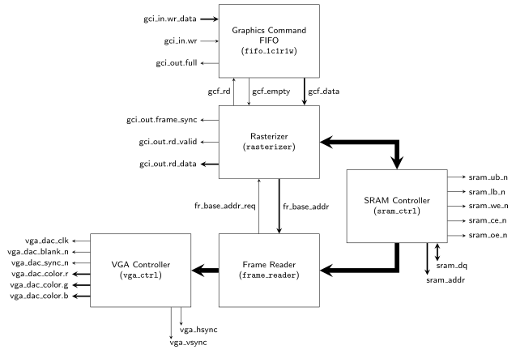

# VGA Graphics Controller Package
The `vga_gfx_ctrl_pkg` package provides a single core that implements a GCI and outputs images using a VGA port. External SRAM is used as video RAM.


[[_TOC_]]

## Required Files

- [frame_reader.vhd](src/frame_reader.vhd)

- [gfx_circle.vhd](src/gfx_circle.vhd)

- [gfx_util_pkg.vhd](src/gfx_util_pkg.vhd)

- [pixel_reader.vhd](src/pixel_reader.vhd)

- [pixel_writer.vhd](src/pixel_writer.vhd)

- [rasterizer.vhd](src/rasterizer.vhd)

- [rasterizer_arch_ref.vhd](src/rasterizer_arch_ref.vhd)

- [vga_gfx_ctrl.vhd](src/vga_gfx_ctrl.vhd)

- [vga_gfx_ctrl_pkg.vhd](src/vga_gfx_ctrl_pkg.vhd)

## Components

### vga_gfx_ctrl
The `vga_gfx_ctrl` implements a GCI (sink), uses 2 MB of external SRAM as Video RAM and outputs a VGA signal.


```vhdl
entity vga_gfx_ctrl is
	port (
		clk   : in std_ulogic;
		res_n : in std_ulogic;
		display_clk   : in std_ulogic;
		display_res_n : in std_ulogic;

		-- gfx command interface
		gci_in : in gci_in_t;
		gci_out : out gci_out_t;

		-- external interface to SRAM
		sram_dq : inout std_logic_vector(15 downto 0);
		sram_addr : out std_ulogic_vector(19 downto 0);
		sram_ub_n : out std_ulogic;
		sram_lb_n : out std_ulogic;
		sram_we_n : out std_ulogic;
		sram_ce_n : out std_ulogic;
		sram_oe_n : out std_ulogic;

		-- connection to VGA connector/DAC
		vga_hsync       : out std_ulogic;
		vga_vsync       : out std_ulogic;
		vga_dac_clk     : out std_ulogic;
		vga_dac_blank_n : out std_ulogic;
		vga_dac_sync_n  : out std_ulogic;
		vga_dac_color   : out vga_pixel_color_t
	);
end entity;
```


#### Interface

The `vga_gfx_ctrl` implements the GCI as specified in the [`gfx_core`](../gfx_core/doc.md) package.
There are only two noteworthy remarks regarding this interface:

  - The `DISPLAY_BMP` only supports bitmaps with a resolution of 320x240 pixels. In fact the command simply assumes that this is the case and does not even check the resolution of the supplied bitmap descriptor (via the `bmpidx` field), it simply treats all bitmaps as if they had this single supported resolution. Hence, if `DISPLAY_BMP` is supplied with a bitmap of a different resolution the output image will be wrong.
  - `DISPLAY_BMP` commands with `fs=1` are only executed when a new VGA output frame is output. This enables the core to synchronize fframe buffer switches to the VGA output signal.

The `vga_dac_*` output signals are intended to interface with a ADV7123 DAC, such as the one found on the [DE2-115 FPGA board](https://www.terasic.com.tw/cgi-bin/page/archive.pl?Language=English&No=502)
Note that altough the only supported output resolution is 320x240 the core produces a VGA signal with a resolution of 640x480.
This is done for the sake of compatibility, since not all monitors support resolutions lower than 640x480. The output image is upscaled internally.

The core is designed to interface with the 2 MB of external SRAM (IS61WV102416BLL) of the [DE2-115 FPGA board](https://www.terasic.com.tw/cgi-bin/page/archive.pl?Language=English&No=502).

The clock signals supplied to `clk` and `display_clk` must have frequencies of 50 and 25 MHz, respectively.
Moreover, their phase relation must be fixed at 0 degrees (i.e., they should be generated from a common source by a PLL).


#### Implementation

The figure below shows an overview of the internal structure of the core:




Incoming graphics commands are written to the *Graphics Command FIFO* (provided by the [`mem`](../mem/doc.md) package), which buffers them until they are executed.
The *Rasterizer* then fetches instructions and their associated operands from this FIFO via the FIFO's read port (`gcf_*` signals).
It executes them by reading and writing pixel data from and to bitmaps in VRAM (physically located in the external SRAM) or altering its internal state (e.g., changing the drawing color, configuring the bitmap descriptor table, setting the graphics pointer etc.).
Communication with the SRAM is handled by the *SRAM Controller* provided by [`sram_ctrl`](../sram_ctrl/doc.md) package.
This controller implements an abstraction-layer over the low-level physical interface of the SRAM and provides three separate ports (2 read ports, 1 write port) that can be operated more or less independently.
Because the actual SRAM chip can only handle one read or write operation at any given time the SRAM controller has to stall individual ports if necessary.
It does that based on a priority scheme (1 = highest priority):

  1. read port 1 (connected to the *Frame Reader*)
  2. read port 2 (connected to the *Rasterizer*)
  3. write port (connected to the *Rasterizer*)

The *Frame Reader* needs the highest priority access, since it constantly reads (60 times per second) the current frame buffer and forwards that data the *VGA Controller*.
If it would not provide the required in time, the output image would be missaliged leading to visual artifacts.
The *Rasterizer* controls the which loction in VRAM, from which the *Frame Reader* fetches the data via the `fr_base_addr` signal.
Whenever the *Frame Reader* is about to fetch a new frame it asserts the `fr_base_addr_req` signal to allow the *Rasterizer* to change the base address.
This is how the frame synchronization (`DISPLAY_BMP` with `fs=1`) is implemented.

The *VGA Controller* itself is provided by the [`vga_ctrl`](../vga_ctrl/doc.md) package.


[Return to main page](../../README.md)
