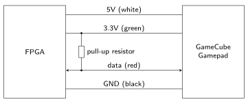
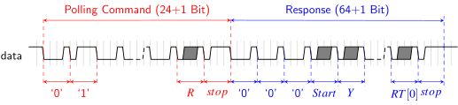
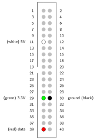

# GameCube Controller

**Points:** 5 `|` **Keywords**: fsm, external interface, 9-valued logic

[[_TOC_]]

Your task is to create and test a `gc_ctrl` module that implements the protocol used by the [GameCube](https://en.wikipedia.org/wiki/GameCube_controller) gamepad.
Note that an obfuscated reference implementation of the `gc_ctrl`, as well as a package containing useful declarations and a documentation, are available in [lib/gc_ctrl](../../../lib/gc_ctrl/doc.md).

## Background

The GameCube uses a simple serial interface to transfer the button states, analog triggers and joystick values over a single (half-duplex) data wire.
The figure below depicts the physical connection between a GameCube gamepad and the FPGA:

A pull-up resistor is used to connect the `data` wire to the supply voltage (3.3 V).
This means that unless a communication partner actively drives `data` low, the state of the wire is logically high.
The additional 5 V supply line is required to drive the rumble motor in the controller.

To start a new transmission to poll the current state (pressed/not pressed) of each button as well as the analog values of the triggers and joysticks (x and y displacement), a 24-bit long polling command (`0100 00000000 0011 0000 000R`) followed by a single (high) stop-bit must be sent to the controller.
The `R` bit allows controlling the rumble motor inside the gamepad.
Setting it to one will activate rumbling until the next transmission cycle.

The individual bits of the poll command are transmitted using a [pulse width encoding](https://en.wikipedia.org/wiki/Pulse-width_modulation), where the transmission of each bit takes 4 µs and always starts with a falling edge on `data`.
Depending on the time `data` remains low after this transition the gamepad will distinguish between different logical values.
For a rising edge after 3 µs (measured from the start of the bit, i.e., the falling edge) the gamepad will consider the transmitted bit to be logic zero, while for a logic one the rising edge must happen after 1 µs.

The timing diagram below visualizes this protocol.

After sending the polling command, the gamepad immediately answers with a 64-bit response using the same pulse width encoding, again followed by a single (high) stop-bit.

The table below lists the meaning of the individual bits of the controller’s response.

|        | 0-2   | 3     | 4   | 5   | 6   | 7   | 8     | 9   | 10  | 11  | 12  | 13  | 14   | 15   | 16-23                     | 24-31                     | 32-39                      | 40-47                      | 48-55                      | 56-63                      | 64            |
|--------|-------|-------|-----|-----|-----|-----|-------|-----|-----|-----|-----|-----|-------|-------|--------------------------|--------------------------|----------------------------|----------------------------|----------------------------|----------------------------|----------------|
| **Bit(s)** | 0-2   | 3     | 4   | 5   | 6   | 7   | 8     | 9   | 10  | 11  | 12  | 13  | 14   | 15   | 16-23                     | 24-31                     | 32-39                      | 40-47                      | 48-55                      | 56-63                      | 64            |
| **Content** | unused (always 0) | Start | Y   | X   | B   | A   | unused (always 1) | L   | R   | Z   | Up  | Down | Right | Left | Joystick X-Axis (MSB @ bit 16) | Joystick Y-Axis (MSB @ bit 24) | C Stick X-Axis (MSB @ bit 32) | C Stick Y-Axis (MSB @ bit 40) | Left Trigger (MSB @ bit 48) | Right Trigger (MSB @ bit 56) | Stop bit (always 1) |

## Description

Start by thoroughly reading the documentation of the provided [gc_ctrl](../../../lib/gc_ctrl/doc.md) core.
Afterwards, create your own implementation in [gc_ctrl_arch.vhd](src/gc_ctrl_arch.vhd).

For your implementation consider the following remarks and hints:

- Your implementation must behave like the provided reference.
  When in doubt, probe how the reference works and align your implementation accordingly.
  However, note that while the reference is configured for a specific set of generics, your implementation must work for arbitrary valid values of `CLK_FREQ`, `REFRESH_TIMEOUT` and `SYNC_STAGES`.

- Although the figure above, illustrating how the gamepad is connected to the FPGA, shows the pull-up resistor as an external component to the FPGA, it is actually an internal resistor integrated into the I/O cell of the chip that can be activated by the FPGA design.
  You don’t have to take care of this resistor, since this has already been configured in the pinout file.

- Note that `data` is used for both, the transmission of the poll command to the gamepad and for the gamepad's response.
  To accommodate for this tri-state logic is used where in order to receive data, the FPGA has to switch off its output driver (i.e., output ’Z’ on `data` pin) immediately after the end of the polling command.

- Note that from the point of view of the FPGA the `data` signal is asynchronous.
  Therefore, it must be synchronized before it can be processed by your FSM.
  You can instantiate a synchronizer lib core (see [libs/sync](../../../libs/sync/doc.md)) for this.

- When you pass the `data` signal to the synchronizer be sure to first pass it through the `to_X01` function.
  This has no impact on logic synthesis, but is important for the simulation, as will be explained below in the testbench section.

## Testbench

The file [`tb/gc_ctrl_tb.vhd`](tb/gc_ctrl_tb.vhd) provides a suitable template for your testbench that already defines the procedures `send_gc_ctrl_state` and `read_polling_command`.
You will have to implement both procedures in order to communicate with the UUT.

One thing you have to take special care of is how you handle the pull-up resistor in simulation.
This is exactly where the properties of the `std_logic` come into play.
Recall that in contrast to the `std_ulogic` data type (the `u` standing for unresolved), `std_logic` is a resolved type, which means that multiple drivers on a signal can be resolved (although the result of this operation can be `'X'`, e.g., in case of two drivers with `'0'` and `'1'`).
You can use this property in your testbench.
Add a concurrent signal assignment (i.e., outside of all processes) in your testbench's architecture, that constantly drives the `data` signal to weak high.
This way you can then pull the signal low by driving it to `'0'` in the main stimulus process.

Your `gc_ctrl` driving it with `'Z'` will result in a weak high signal level due to the defined resolution function.
This is the reason why the data signal must be passed to the `to_X01` function, because this function converts the weak high signal level to `'1'`.

Simulate the transmission of 8 polling sequences using the two procedures.
For the state of the GameCube gamepad randomly generate a corresonpding `std_ulogic_vector` value and map it to a controller state.
The `rumble` input of the UUT shall also be set to a random value for each transmission.

Use the waveform viewer to verify that the timing of the `data` signal is correct.
Note that for the simulation you may use a small value for `REFRESH_TIMEOUT`.

## Hardware

Once you have implemented and tested your `gc_ctrl`, use the provided architecture in [top_arch.vhd](top_arch.vhd) to verify its functionality in hardware.
This provided architecture already connects all gamepad buttons to the FPGA board's red LEDs, and the analog triggers and joysticks to the hex displays (the idle position of the joysticks is `128` / `x80`).
Since there is not enough hex display to display all these values at once, the right-most switch can be used to toggle between the (gray) joystick and the (yellow) `C` input being displayed.
Verify that pressing the buttons / using the triggers and joysticks results in the expected change of these peripherals.

**Optional**: If you want to, you can, of course, also use your `gc_ctrl` implementation in your Tetris game to play around.
Simply instantiate a `gc_ctrl` next to the already instantiated `snes_ctrl` and connect the `ctrl_state` output accordingly.
You can control the rumble feature at an arbitrary event in the game like, for example, upon a gameover or whenever a row is eliminated.

**Important**: The gamepad must be correctly connected to the board's GPIO connector; otherwise the board and / or the gamepad might be damaged.
The correct way to connect the gamepad is shown below.
Ask a tutor for help if you are unsure how to proceed!

## Delieverables

- **Create**: period.png

- **Implement**: [gc_ctrl_arch.vhd](src/gc_ctrl_arch.vhd)

- **Implement**: [gc_ctrl_tb.vhd](tb/gc_ctrl_tb.vhd)

[Return to main page](../../../README.md)
