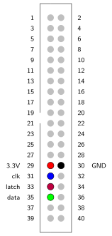

# SNES Controller

**Points:** 10 `|` **Keywords**: fsm, external interface

[[_TOC_]]

Your task is to create and test a `snes_ctrl` module that implements the protocol used by the [SNES (Super Nintendo Entertainment System)](https://en.wikipedia.org/wiki/Super_Nintendo_Entertainment_System) gamepad.
Note that an obfuscated reference implementation of the `snes_ctrl`, as well as a package containing useful declarations and a documentation are available in [lib/snes_ctrl](../../../lib/snes_ctrl/).

## Background

Before we describe the required module you will implement, let us briefly introduce the SNES gamepad's serial interface.
The SNES gamepad, as well as its predecessor the NES controller, are based on a simple parallel-in/serial-out shift register (like the [CMOS 4021 shift register](https://www.ti.com/product/CD4021B)).
The gamepad uses a serial interface consisting of three signals (`clk`, `data` and `latch`).
When there is a high pulse on `latch`, the gamepad latches each of its buttons' current state (pressed / not pressed) in an internal shift register (this referred to as *parallel load*).
Next, a dedicated clock signal, `clk`, signal can be applied to serially shift out the latched button states.
Since this is internally a shift-register, the `data` provided by the SNES gamepad will change at each active (rising) clock edge (since the shift-register "shifts" on each rising clock edge).
Note that since the internal shift register consists of two 8-bit wide shift registers, although the gamepad only has 12 buttons, 16 bits are always transmitted.
The last four data bits are always set to 1.

Below is an example of one complete transmission, meaning that all button states are read (in exactly this order).

## Description

Start by thoroughly reading the documentation of the [provided `snes_ctrl` core](../../../lib/snes_ctrl/doc.md).
Afterwards, create your own implementation in [snes_ctrl_arch.vhd](src/snes_ctrl_arch.vhd).

For your implementation consider the following remarks and hints:

- Your implementation must behave like the provided reference.
When in doubt, probe how the reference works and align your implementation accordingly.
However, note that while the reference is configured for a specific set of generics, your implementation must work for arbitrary valid values of `CLK_FREQ`, `REFRESH_TIMEOUT` and `CLK_OUT_FREQ`.

- Note that the `snes_data` signal is *active-low*, i.e., if a gamepad button is pressed, the respective bit of `snes_data` will be *low*.
The `ctrl_state` output is active-high.

- **Do not use frequencies above 500 kHz** (due to timing constraints of the gamepad's internals).

- The `snes_data` input must be properly synchronized. You can use the provided [sync](../../../lib/sync) module for that.

- Since `snes_data` changes with the rising edge of `snes_clk`, make sure to sample `snes_data` right before the next rising edge, as this gives the `snes_data` signal the highest possible time to stabilize (thus helping in meeting setup time constraints).
In the example transmission above these sampling times are marked by the orange lines.

## Testbench

Implement a testbench for your `snes_ctrl` in the provided [snes_ctrl_tb.vhd](tb/snes_ctrl_tb.vhd) file.
In particular, you have to do the following steps:

- Implement the already declared `generate_snes_data_input` procedure which shall generate the correct `snes_data` waveform for the respective value of the `snes_ctrl_state_t` input parameter.
You can use the rising edge of `snes_latch` as suitable point in time to check the current value of `ctrl_state` and the falling edge to start your transmission.

- Generate 64 random test values and assert that the `ctrl_state` output of the `snes_ctrl` UUT matches the values supplied to the `generate_snes_input` procedure.

- Use the waveform viewer to verify that the period of the `snes_clk` signal adheres to the `CLK_OUT_FREQ` generic.
Provide a screenshot (`period.png`), that shows this, including the `CLK_FREQ` and `CLK_FREQ_OUT` generics, the `snes_clk` signal and respective cursors.

- You may want to set `REFRESH_TIMEOUT` to a small value in your testbench.

## Hardware

Once you have implemented and tested your `snes_ctrl`, use the provided architecture in [top_arch.vhd](top_arch.vhd) to verify its functionality in hardware. To do this, connect each record entry of the `ctrl_state` output to a dedicated LED of `ledr` and verify that your implementation correctly detects each button press on the gamepad.

**Important**: The gamepad must be correctly connected to the board's GPIO connector; otherwise the board and/or the gamepad might be damaged.
The correct way to connect the gamepad is shown below.
Ask a tutor for help if you are unsure how to proceed!

## Delieverables

- **Implement**: [snes_ctrl_arch.vhd](src/snes_ctrl_arch.vhd)

- **Implement**: [snes_ctrl_tb.vhd](tb/snes_ctrl_tb.vhd)

- **Implement**: [top_arch.vhd](top_arch.vhd)

- **Create**: period.png
