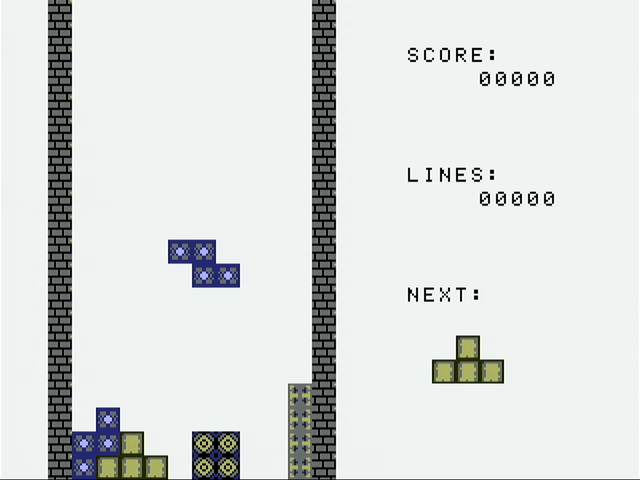
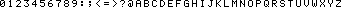
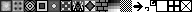

# Tetris

**Points:** 25 `|` **Keywords**: fsm, specifications, filling gaps, reading code

[[_TOC_]]

In this task you will implement the Tetris game logic and create your own Tetris game console.


## Description

The `tetris` game module features the following interface:


```vhdl
entity tetris is
	port (
		clk : in std_ulogic;
		res_n : in std_ulogic;

		-- interface to vga_gfx_ctrl
		gci_in  : out gci_in_t;
		gci_out : in gci_out_t;

		--connection to the gamepad
		gamepad : in tetris_gamepad_t;
		rumble  : out std_ulogic
	);
end entity;
```


As can be seen from the interface the `tetris` module implements a GCI (refer to the [`gfx_core` package](../../../lib/gfx_core/doc.md)).
We already provide you with a template architecture, that initializes this interface and loads the required assets for the Tetris game into VRAM.
It also sets up a basic "main" loop for your game that you can use as the basis for your implementation.
Moreover, it demonstrates how to interface with the `decimal_printer`, `tetromino_drawer` and `tetromino_collider` library cores, that implement important core functionality of the game.
Therefore, start by studying the provided code.
To find out what it already does, synthesize it and run it on the FPGA board.


The figure below shows a screenshot of how the final game shall look like and what information it shall display.




To avoid describing the mechanics of the game in every detail, we refer to the reference solution, provided as a bitstream in `/opt/ddca/tetris.sof` in the TILab.
Your implementation of the game shall behave and be controlled the same as the reference solution.
Therefore, when in doubt, you can probe the reference solution and implement the identical behavior.

You can choose an appropriate speed for the game (i.e., the speed with which the tetrominoes fall down the map).
Note that, unlike the "real" Tetris game our version does not get faster as the game progresses.
However, if you want you may implement this feature as well.


### Controlling the game

Note that in order to make controlling the game independent of the actual physical gamepad used by the design, the [tetris_pkg](src/tetris_pkg.vhd) defines a custom record type:


```vhdl
type tetris_gamepad_t is record
	a, b : std_ulogic;
	start, sel : std_ulogic;
	dir_left : std_ulogic;
	dir_right : std_ulogic;
	dir_up : std_ulogic;
	dir_down : std_ulogic;
end record;
```


This type is used for the `gamepad` input.
You can simply connect the buttons of the SNES (and later the Gamecube) gamepad to the appropriate signals of this record in the top-level architecture.

The controls for the game are as follows:

| Button | Function |
|-|---|
| Up    (`dir_up`)    | Rotate the current tetromino by 90 degrees (clockwise).|
| Left  (`dir_left`)  | Move the current tetromino on the map one block to the left.|
| Right (`dir_right`) | Move the current tetromino on the map one block to the right.|
| Down  (`dir_down`)  | Move the current tetromino on the map down one block.|
| A     (`a`)         | Move the current tetromino downwards until it collides with something.|
| Start (`start`)     | Restart the game when the previous game is over.|

The `rumble` output (for controlling an optional gamepad rumble motor) is not used in this task and can therefore be left unconnected.


### Graphical Output

As already mentioned the `tetris` game module implements a GCI and the provided template already initializes this interface.
In particular the initialization code sets the primary / secondary color to black / white (0x00 / 0xff) and creates two empty bitmaps of size 320x240 at indices 0, respectively 1, in the bitmap descriptor table (BDT).
These two bitmaps are needed by the template to implement [double buffering](https://en.wikipedia.org/wiki/Multiple_buffering#Double_buffering_in_computer_graphics).
Furthermore, the bitmaps at indices 2 and 3 in the BDT are initialized to the following images:







The first bitmap contains a font with 8x8 pixel characters, that can be used to print text via the `BB_CHAR` command.
The second bitmap contains a series of 12x12 pixel game tiles for drawing the tetrominoes and game field borders.

To draw tetrominoes, use the `tetromino_drawer` module provided by the [`tetris_util_pkg`](../../../lib/tetris_util/doc.md) package.
The `decimal_printer` provided by the [`decimal_printer_pkg`](../../../lib/decimal_printer/doc.md) package can be used to draw the game score and the number of lines.


### Collision Detection

The game field (i.e., the current map of tetrominoes) shall be represented by an on-chip RAM.
To assist you with the implementation of the collision detection between the currently "falling" tetromino and the blocks on the map as well as the walls, the [`tetris_util`](../../../lib/tetris_util/doc.md) package provides the `tetromino_collider`.
The template architecture already contains an example demonstrating how to use it.

When you detect a collision between the current tetromino and the map, you will have to convert the current tetromino to solid blocks on the map (i.e., set certain locations in the on-chip memory that represents the map to a value that indicates that the respective position is solid).
Here the function `is_tetromino_solid_at` provided by the [`tetris_util`](../../../lib/tetris_util/doc.md) package will be useful.
Whenever a tetromino is placed on the map, you need to check if lines are complete and remove them if necessary.
Placing a tetromino on the map can lead to the removal of up to four rows.


### Scoring

The games keeps track of two values: the total number of lines removed during a game and the score of the player.
Both of these values start at zero.
The score is increased depending on how many rows are removed simultaneously.

|rows removed | score |
|-|-|
| 1 | 1 |
| 2 | 3 |
| 3 | 6 |
| 4 | 10 |


### Tetromino Generation

Make sure that upon reset of the `tetris` module, the exact same sequence of tetrominoes appears as in the reference solution.
The reference solution always starts with a Z-type tetromino followed by an I-type one.
Whenever a new (random) tetromino is needed in the template architecture the `prng_en` is asserted for exactly one clock cycle.
You can directly use this implementation as it will generate the required sequence of tetrominoes.

New tetrominoes must always be placed in the center of the upper end of the map.
If placing a new tetromino immediately leads to a collision with map blocks, the game is over.
To signify this condition to the player, the newly added tetromino (that caused the collision) should blink.
Pressing the start button on the gamepad starts a new game, all other inputs (i.e., arrow keys and the A button) are ignored.


### Hints

We recommend you to stick to the suggested implementation sequence:
- Try-out and study the provided template.
- Implement the rendering of the map and its borders.
- Add functionality that converts the current tetromino to solid blocks on the map.
- Add detection for complete lines and implement their removal from the map.
- Implement the automatic downwards movement.
- Add the score/lines display.


## Testbench

Use and extend the provided [testbench template](tb/tetris_tb.vhd) to simulate your game using your `gfx_cmd_interpreter`.
For the final submission, your testbench should (at least) show a game where three tetrominoes are moved, rotated and placed on the game field meaningfully.


## Hardware

For your top-level architecture, create an instance of your `tetris` game module, the [`vga_gfx_ctrl`](../../../lib/vga_gfx_ctrl/doc.md) and your `snes_ctrl`. Wire the buttons of the SNES gamepad to the appropriate signals of the `gamepad` input of the `tetris` module.

Download and test your game on the hardware.


## Delieverables

- **Implement**: [`tetris_arch.vhd`](src/tetris_arch.vhd)

- **Implement**: [`tetris_tb.vhd`](tb/tetris_tb.vhd)

- **Implement**: [`top_arch.vhd`](top_arch.vhd)


[Return to main page](../../../README.md)
