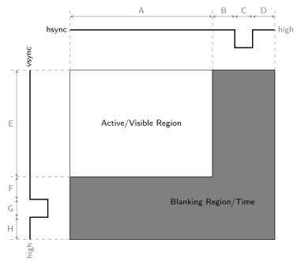
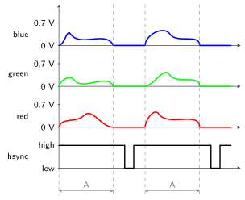

# VGA Controller

**Points:** 10 `|` **Keywords**: external interface, advanced testbench, oscilloscope

[[_TOC_]]

Your task is to create a VGA controller to interface with DE115-2's VGA connector and display images on external screens.
Note that an obfuscated reference implementation of the `vga_ctrl`, as well as a package containing useful modules for testing, declarations and a documentation are available in [lib/vga_ctrl](../../../lib/vga_ctrl/doc.md).

## Background

The following explains how the [VGA protocol](https://en.wikipedia.org/wiki/Video_Graphics_Array) works (external interface).

Each frame consists of a visible portion, that will actually be displayed on the receiving screen, and so-called *blanking regions* that are used for synchronization.
A frame is transmitted as a series of horizontal lines, starting at the top of the frame.
However, only a subset of these lines actually represent the visible image, the remaider is part of the *vertical blanking region*.
Similarly, only a subset of clock cycles per line is actually used to tramsit the colors of pixels on the line.
The remaining clock cycles are part of the *horizontal blanking region*.

The figure below shows the general structure and timing of a frame.
The overall transmission starts at the top-left of the shown frame and hence with the visible portion.
As mentioned above, one can clearly see that not all clock cycles of each line, and not all lines, actually contribute towards transmitting the pixel data.

Within the blanking regions the horizontal / vertical synchronization signals (`hsync` / `vsync` are pulsed to **low** for a certain time).
This pulse can be used by the screen receiving the VGA signal to synchronize (very old screens used these pulses to re-position their electron beams).

The actual timing values depend on the chosen resolution.
However, for a resolution of 640x480 (which we'll use in DDCA) the timings can be found in the table below, where the *Symbol* column with its entries A-H refers to the same symbols in the image above.

| Symbol| Parameter| Value (640x480) | Unit |
|-|------| ---------------| ------------------ |
| A | Horizontal Visible Area | 640 | cycles|
| B | Horizontal Front Porch | 16 | cycles|
| C | Horizontal Sync. Pulse Width | 96 | cycles|
| D | Horizontal Back Porch | 48 | cycles|
| E | Vertical Visible Area | 480 | lines|
| F | Vertical Front Porch | 10 | lines|
| G | Vertical Sync. Pulse Width | 2 | lines|
| H | Vertical Back Porch | 33 | lines|

It's worth noting that online explanations may use alternative reference points for specifying the timings.

Finally, the pixel data itself that is transmitted within the active window of a frame consists of three **analog** signals.
 In particular, the pixel data consists of an analog signal for the red, green and blue color component of a pixel.
 The intensity of each color components depends on the analog voltage level where a value of 0V corresponds to no contribution from this color component at all, to 0.7V for the maximum contribution.
 During the blanking regions all color component signals are set to 0V (and overall thus black).
 The image below illustrates this by showing the RGB values during the transmission of two lines in the active region of a frame.

However, since our FPGA cannot directly output analog voltages, we need to interface with the [ADV7123](https://www.analog.com/media/en/technical-documentation/data-sheets/ADV7123.pdf) Analog-to-Digital Converter (ADC) of the DE2-115 board.
This DAC is made for video transmissions in particular and allows us to drive the analog VGA color signals.

## Description

Start by thoroughly reading the documentation of the [provided `vga_ctrl` core](../../../lib/vga_ctrl/doc.md).
Afterwards, create your own implementation in [vga_ctrl_arch.vhd](src/vga_ctrl_arch.vhd).

For your implementation consider the following remarks and hints:

- Your implementation must behave like the provided reference.
  When in doubt, probe how the reference works and align your implementation accordingly.
  However, note that while the reference is configured for a specific set of generics, your implementation must work for arbitrary valid values of the generics **during simulation**.
  For hardware tests is suffices if the 640x480 case with the given generics works.

- Note that our video mode, theoretically requires a clock with a frequency of 27.175 MHz.
  However, for the sake of simplicity we use 25 MHz, as most displays are fine with this slightly off-spec frequency.
  For that purpose you are already provided with a phase-locked loop (PLL) IP instantiation in [pll.vhd](src/pll.vhd).
  This PLL is configured to generate a 25 MHz clock and already properly connected in top_arch.
  I.e., you do not have to do anything to get a 25 MHz clock.

- As already implied, when interfacing with the ADV7123 DAC, directly connect `clk` to `vga_dac_clk`.

- The `vga_dac_sync_n` signal is not needed for this task and you can permanently set it to `'1'`.

- Be sure to accomodate for the fact that the DAC conversion is not instantaneous and delay your synchronization signals appropriately.

- Ensure that your implementation works for other resolutions as well (in simulation) and not just for the generics given in the table above.

## Testbench

Test your `vga_ctrl` implementation using the provided testbench in [vga_ctrl_tb.vhd](tb/vga_ctrl_tb.vhd).
This testbench applies a test pattern to your implementation and dumps the resulting frames as bitmaps to your local file system (for details be referred to the [lib core documentation](../../../lib/vga_ctrl/doc.md).

Modify the testbench to feature assertions that check if all timings of the VGA protocol are satsified for a given set of generics.
Furthermore, make sure that your implementation also works for other resolutions than 640x480.

Note that, if required for debugging, the testbench allows you to easily apply manual stimuli rather than the one generated by the test pattern generator via a multiplexer.

## Hardware

Once you have implemented and tested your `vga_ctrl` implementation, use the provided architecture in [top_arch.vhd](top_arch.vhd) to test your implementation on hardware.
The provided top architecture already connects your implementation to an instance of the test pattern generator.
I.e., if your implementation works correctly you should see the test pattern image on the VGA screen (or remotely in the respective stream).

Perform an oscilloscope measurement to demonstrate the correctness of the VGA signal you are generating.
If you are working in the TILab, connect the oscilloscope to an FPGA board using the provided cable.
Connect the three color channels and the horizontal synchronization signal to the four inputs of the device.

If you want to use the Remote Lab you have to use the host `ti50`. The board located at this host is already connected to an oscilloscope that can be controlled using our web interface.
Channels 1 to 3 of this oscilloscope are connected to the R, G and B channels of the VGA signal in this order, while channel 4 is connected to the horizontal synchronization (`hsync`) signal.

Make a measurement showing one of the visible lines that goes through the *gradient* area of the test image.
Use markers to measure the length of the whole line as well as the length of the synchronization pulse.
Make a screenshot of the measurement and provide it as oscilloscope.png.
Note that the oscilloscope in the TILab is able to write to USB flash drives.

## Delieverables

- **Create**: oscilloscope.png

- **Implement**: [vga_ctrl_arch.vhd](src/vga_ctrl_arch.vhd)

- **Implement**: [vga_ctrl_tb.vhd](tb/vga_ctrl_tb.vhd)

[Return to main page](../../../README.md)
