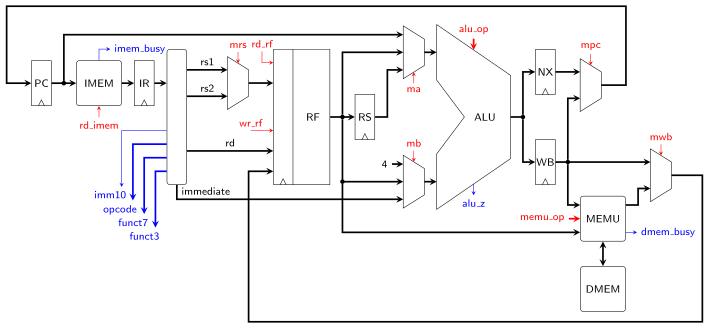

# RISC-V Multi-Cycle FSM Implementation

**Points:** 25 `|` **Keywords**: risc-v, specifications

[[_TOC_]]

A single ISA can have vastly different hardware implementations.
In the computer architecture lecture you might already have learned about the classic five-stage pipeline implementation.
However, before we tackle the pipelined version, we first look at a simpler multi-cycle variant during this task.


## Description

The core you are going to implement in this task only executes a single instruction at a time and takes multiple clock cycles to do so.
An FSM (`ctrl_fsm`) controls this execution process and sets the appropriate control signals for the various parts of the circuit.
At the end of this task, you will have a synthesizable RISC-V core (for the RV32I instruction set), that can be downloaded to the FPGA, capable of executing arbitrary code.

The processor core has to be implemented as another architecture for the [`rv`](../../../lib/rv_sys/src/rv.vhd) entity.


```vhdl
entity rv is
	generic (
		CLK_FREQ : positive := 50_000_000
	);
	port (
		clk      : in std_ulogic;
		res_n    : in std_ulogic;
		-- Interface to instruction memory
		imem_out : out mem_out_t;
		imem_in  : in mem_in_t;
		-- Interface to data memory
		dmem_out : out mem_out_t;
		dmem_in  : in mem_in_t
	);
end entity;
```


The figure below shows an overview of the core's architecture.




It consists of

 * five registers named `PC`, `IR`, `RS`, `NX` and `WB`
   * `PC`: Program Counter
   * `IR`: Instruction Register
   * `RS`: Source Register Buffer
   * `NX`: Next Program Counter
   * `WB`: Write Back Register
 * five multiplexers controlled by the signals `ma`, `mb`, `mrs`, `mpc`, `mwb`
 * a single ALU that carries out *all* arithmetic (and logic) operations (i.e., including program counter manipulations)
 * some combinational logic, that extracts the `immediate` and the instruction fields `rd`, `rs1`,`rs2`, `opcode`, `funct3` and `funct7`
 * the register file (`RF`) with a single read and write port
   * the read address of this memory is either `rs1` or `rs2` (depending on `mrs`) and `rd_rf` is its read flag
   * the write address is `rd`, the write data is controlled by `mwb` and `wr_rf` is the write flag

The blocks labeled `IMEM` and `DMEM` represent the interfaces to the instruction and data memory, respectively (i.e., to the ports `{i,d}mem_{in,out}` of the `rv` entity).

Your task is to implement this architecture and design a suitable FSM that controls the sequence of operations in this circuit.
The interface of this FSM is shown below:


```vhdl
entity ctrl_fsm is
	port (
		clk : in std_logic;
		res_n : in std_logic;
		opcode : in opcode_t;
		funct3 : in funct3_t;
		funct7 : in funct7_t;
		imm10 : in std_ulogic;
		alu_z : in std_ulogic;
		dmem_busy : in std_ulogic;
		imem_busy : in std_ulogic;
		ma : out ma_ctrl_t;
		mb : out mb_ctrl_t;
		mpc : out mpc_ctrl_t;
		mrs : out mrs_ctrl_t;
		mwb : out mwb_ctrl_t;
		wr_pc : out std_ulogic;
		wr_ir : out std_ulogic;
		wr_wb : out std_ulogic;
		wr_nx : out std_ulogic;
		rd_rf : out std_logic;
		wr_rf : out std_logic;
		rd_imem : out std_ulogic;
		alu_op : out rv_alu_op_t;
		memu_op : out memu_op_t
	);
end entity;
```


All signals marked blue in the overview figure above are inputs to this FSM, while red signals are outputs that the FSM has to generate.
The enable signals of the individual registers (i.e., `wr_pc`, wr_ir`, `wr_wb`, `wr_nx`) are not shown in the figure, but they also have to be generated by your state machine.

Your state machine shall start in a state where it fetches the next instruction from the instruction memory (addressed by the `PC`; starting at address 0).
The fetched instruction is then stored in `IR`, where it is decoded.
Depending on the type of the instruction, the FSM shall then cycle through an appropriate sequence of states to perform the necessary operations (e.g., reading/writing the register file, performing calculations with the ALU, etc.) in order to execute the instruction.
The last operation for every instruction is writing the updated program counter value into the `PC` register.
Then the whole process starts over.


### Hints

* Use the ALU from the [`rv_alu`](../../../lib/rv_alu/doc.md) package.
* Use the provided [rf_ram](./src/rf_ram.vhd) for the register file. This core already handles the special register 0 correctly, i.e., reading address 0 always returns zero.
* Use the `memu` provided as part of [rv_sys](../../../lib/rv_sys/doc.md) to interface with the data memory.
* You can always calculate `PC`+4 for any instruction (and store the result in `NX`).
* Some operations can be done in parallel: e.g., reading the register file and calculating a memory address with the ALU.
* Not all instructions require the same number of cycles to execute.
* If an instruction needs both source operands (i.e., `rs1` and `rs2`) the register file needs to be read twice (i.e., in two cycles). The purpose of `RS` is to buffer the result of the first read. For instructions with one or no source operand, `RS` is not used.
* The `WB` register has three functions:
  * hold the result of an ALU operation that needs to be written back to the register file
  * hold the memory address for a load or store operation
  * hold the target address for a branch instruction
* The FSM can be implemented in a way that it only internal state is the state enum


### Optimization (Optional)

The provided core architecture can be optimized a little bit.
The way it is set up now, the register file can only be read after `IR` has been updated.
However, by taking the `rs1` field directly from the instruction provided by the instruction memory, we could perform these two operations in parallel and save a cycle.
The first operand would then already be available when `IR` is updated.

**Note**: Only try this bonus task, if your core already works flawlessly.


## Testbench

Simulate the `rv_fsm` core exactly as described in the [`rv_sim`](../rv_sim/task.md) task.


## Hardware

Use the provided Quartus project and top-level architecture to synthesize your core.
Download it to the FPGA and run some of the provided C programs.
Observe the UART output to see whether your processor executes them correctly.


## Delieverables

- **Implement**: [`ctrl_fsm.vhd`](src/ctrl_fsm.vhd)

- **Implement**: [`rv_fsm.vhd`](src/rv_fsm.vhd)


[Return to main page](../../../README.md)
