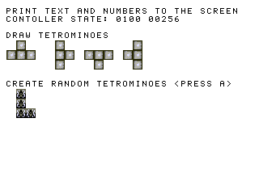

# RISC-V Tetris

**Points:** 5 `|` **Keywords**: risc-v, c software development

[[_TOC_]]

In this task you will essentially replace the `tetris` core developed in Level 1 with a RISC-V core and implement the game logic in software.
Only try this task if the [`rv_fsm`](../rv_fsm/task.md) works without **any** issues!

## Description

The structure of this task is a little different from all the other tasks as you don't have to implement any hardware components.
The `software` subdirectory contains the template for the Tetris game.
Similar to the [`tetris_util_pkg`](../../../lib/tetris_util/doc.md) package, the [`tetris_util.h`](software/tetris_util.h) header file provides some utility functions to assist you with the implementation of the actual game logic.
Likewise, the [`gfx_util.h`](software/gfx_util.h) header file features functions concerned with generating graphical output over the GCI.
For low-level access to the GCI use the driver functions in the [`util.h`](../../../lib/rv_sys/sdk/util.h) header file.
The provided [`main.c`](software/main.c) source file, already contains some code demonstrating the functionality of the provided library functions.

Running this code (either in simulation or on the hardware) should produce an output similar to:

Implement the Tetris game using the provided template.
The game shall behave exactly like specified in the [`tetris`](../../level1/tetris/task.md) task.

## Testbench

For the sake of completeness we provide you with a testbench that uses your graphics command interpreter (from Level 1) to output the generated images.
However, as you don't have to debug the hardware in this task, you will likely not really need it.
You can test your software directly on the FPGA.

## Hardware

Notice that the top-level architecture looks quite similar to the one of the [`tetris`](../../level1/tetris/task.md) task.
It also contains instances of the `snes_ctrl` as well as the `vga_gfx_ctrl`.
However, instead of the `tetris` module we now have an instance of the `rv` core alongside the `rv_sys` module providing the interface to the processor's peripherals.
The `snes_ctrl` is connected to the GPIOs of the `rv_sys` module.
Additionally, the GPIOs are used to load the graphics commands required to initialize the GCI and the VRAM with the Tetris game assets.

Use the provided Quartus project to synthesize your design, download it to the FPGA and run your software.

## Delieverables

- **Implement**: [`main.c`](software/main.c)

[Return to main page](../../../README.md)
