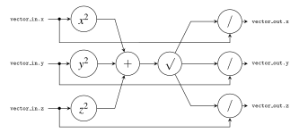

# Vector Normalization

**Points:** 10 `|` **Keywords**: pipeline, fixed-point, ip cores, file i/o

[[_TOC_]]

In this task you will design a simple pipeline, which makes use of different IP cores to compute the vector norm of *fixed-point* 3D-vectors with high throughput.


## Background

Below you will find the required information about normalizing vectors and fixed-point arithmetic.
You will need both for this task.


### Vector Norm

Given a 3D-vector
$$
\mathbf{v}=\begin{pmatrix}
x & y & z
\end{pmatrix}^T
$$

it is normalized by dividing it by its length.

The resulting unit vector $\mathbf{\hat v}$ is therefore given by

$$
\mathbf{\hat v}=\frac{\mathbf{v}}{|\mathbf{v}|}=\frac{1}{\sqrt{x^2+y^2+z^2}}\cdot
\begin{pmatrix}
x\\
y\\
z
\end{pmatrix}
$$


### Fixed-Point Arithmetic

As you might know, circuits for performing floating point arithmetic are quite complex and area-demanding.
However, depending on the application, the precision offered by floating point arithmetic might not always be necessary.
Instead, *fixed-point* arithmetic can be used.
As the name suggests, this kind of arithmetic assumes that the mantissa of the stored numbers is the same for all of them, and that it is constant.
As a result, mathematical operations on fixed-point numbers can be carried out using simple integer arithmetic and its simpler and cheaper circuits.

Depending on the amount of bits used for the integer and the fraction part of a fixed-point number, different fixed-point number formats can be distinguished.
A simple way to specify them is the [Q Number Format](https://en.wikipedia.org/wiki/Q_(number_format)), which essentially expresses a fixed-point number format as $QX.Y$ where $X$ is the number of bits used to store the integer part, and $Y$ the number of bits available for the fraction part.

In this task you will exclusively use the Q16.16 format (signed).
Hence, each number is stored using 32 bits, where the most significant 16 bits are used for the integer part, and the 16 least significant bits are used for the fraction part.
Because of this structure, a Q16.16 number $q$ can be converted to a real number by multiplying it with $2^{-16}$.
For example, the 32-bit word `0x0001_8000` encodes the real number 1.5 in the Q16.16 format.

You also have to consider the particular structure of Q16.16 numbers when performing arithmetic operations on them.
For example, consider two Q16.16 numbers $q_1=a\cdot2^{-16}$ and $q_2=b\cdot 2^{-16}$.
Multiplying them will result in $q_1\cdot q_2=a\cdot 2^{-16}\cdot b\cdot2^{-16}=(a\cdot b)\cdot2^{-32}$.
Obviously this is no longer a Q16.16 number.
However, given its structure and the fact the result of multiplying two 32-bit numbers is a 64 bit number, we can observe that this multiplication will yield a Q32.32 number.
To convert this to the desired Q16.16 result, one can simply take the middle 32 bits (you can disregard overflows for this task).

 Similarly, for all operations one must consider how the result will look like and how the desired one can be obtained.


## Description

Your task is now to implement the above described vector normalization for 3D vectors in the Q16.16 format in an architecture of the `vnorm` entity (shown below) in [`vnorm.vhd`](src/vnorm.vhd).

```vhdl
component vnorm is
	port (
		clk        : in  std_ulogic;
		res_n      : in  std_ulogic;
		vector_in  : in  vec3_t;
		valid_in   : in  std_ulogic;
		vector_out : out vec3_t;
		valid_out  : out std_ulogic
	);
end component;
```


The `clk` and `res_n` inputs are for the clock and an asynchronous, active-low, reset.
Whenever `valid_in` is high in a clock cycle, `vnorm` reads in the valid 3D vector applied at `vector_in` (you can find the respective type declaration in [`vnorm_pkg.vhd`](src/vnorm_pkg.vhd)).
Similarly, whenever `valid_out` is high for a clock cycle, `vnorm` applies the result of a vector normalization operation at `vector_out`.
Note that a new vector can be applied at `vector_in` in *each* clock cycle, regardless whether a normalization operation for a previously applied vector is still on-going (details below).


Internally, in order to achieve a high throughput (one normalization result provided per clock cycle), `vnorm` shall implement a pipeline.
The **datapath** (only the operations but not registers are shown) of this pipeline is depicted in the figure below:




For the multiplication, square root and division operations use the respective IP cores ([`LPM_MULT`](https://www.intel.com/content/www/us/en/docs/programmable/683490/20-3/lpm-mult-multiplier-ip-core.html), [`ALTSQRT`](https://application-notes.digchip.com/038/38-21645.pdf), [`LPM_DIVIDE`](https://www.intel.com/content/www/us/en/docs/programmable/683490/20-3/lpm-divide-divider-intel-fpga-ip-core.html)) provided by the FPGA vendor (Intel).
You will find a short description on how to instantiate them in a dedicated section further below.


After instantiating the IP cores, take care to introduce the required registers for

  - buffering the input values needed during the division
  - generating the `valid_out` output out of `valid_in` (use a shift-register)

Since the IP cores are internally already pipelined themselves you do not really need any further registers.


**Important**: Make sure to read the part about the testbench before you start with your implementation efforts. The testbench in this task is very powerful in checking if your design is correct and it can easily be used to check only parts of the computation (providing different input data) are right.
Hence, we *strongly recommend* the following: As a first step implement the datapath of `vnorm` by using the (non-synthesizable) floating point arithmetic on the `real` type (the `vnorm_pkg` provides respective conversion functions).
Then, using this simple model, implement the testbench and ensure that it works.
After that, develop the "real" `vnorm` module using the IP cores.


Also note that you do not have to deal with rounding or overflows and that the provided test data does not trigger overflows.


### Instantiating an IP Core

To use one of the IP cores provided in Quartus' IP catalog, first click on `View -> Utility Windows -> IP Catalog`.
Now you can use the search field to search for an IP core (e.g. `LPM_MULT`) and double-click it.
Quartus will now start the process of creating an IP variation file, i.e., a specific instantiation of the generic IP core tailored to your demands.
Choose a suitable directory to hold this IP variation file, e.g. in `top/src` and set the file type to `VHDL`.

Next, Quartus will open a wizard that allows you to configure your IP variation.
Click through the wizard and set the parameters as you see fit for your pipeline.
Finally, Quartus will ask you if you want to add the IP variation file to the project.
Next, `Yes` should be selected; then `Finish` the wizard.

You can now instantiate your IP variation in your design.

Use the following pipeline depths for the different IP cores:

| IP | Pipeline depth |
| -- | -------------- |
| LPM_MULT | 1 |
| ALTSQRT | 16 |
| LPM_DIVIDE | 48 |

**Note**: Unfortunately the [documentation](https://www.intel.com/content/www/us/en/docs/programmable/683490/20-3/altsqrt-integer-square-root-ip-core.html) of the `ALTSQRT` module provided by Intel is not entirely clear / correct regarding the `remainder` output and how it is related to the `R_PORT_WIDTH` generic.
Instead, be referred to the older, but correct, [documentation](https://application-notes.digchip.com/038/38-21645.pdf) provided by Altera and set the `R_PORT_WIDTH` generic to the value corresponding to `WIDTH/2+1`.


## Testbench

To test your `vnorm` implementation you will create a file-based testbench that applies stimuli provided in a file to the UUT and then matches its output with some reference data provided in another file.
To achieve this, complete the testbench template provided in [`vnorm_tb.vhd`](tb/vnorm_tb.vhd).

The stimuli are provided in [`input.txt`](tb/input.txt), where each 3D input vector consists of three consecutive lines, containing the x, y, z components given as 32-bit hexadecimal numbers.
Furthermore, the input file can contain comment lines, where the line starts with '#', as well as empty lines.
This allows to comment particular test cases in the file and to potentially give it a bit more structure.
For example, a valid input file could look like this:

```
# Testcase 1
AAAABBBB
12345678
00000000

# Testcase 2
00000001
DEADBEEF
01010101
```

In each clock cycle, read the next input vector from the input file and apply it to the `vnorm` instance until the end of the file is reached (you can assume that vectors are always complete, i.e., that the number of vector component lines is always a multiple of 3).
When reading in a vector, make sure to skip comments and empty lines.

To check the correctness of your design on the applied data, read in the reference data provided in [`ref.txt`](tb/ref.txt) (which has the same structure as the stimuli file) and assert that `vnorm` reports the correct result (and automatically report any wrong computations).
To simplify this, the [`vnorm_pkg.vhd`](src/vnorm_pkg.vhd) file defines an overload of the `=` operator for 3D vectors.
However, note that due to rounding in the datapath `vnorm` might yield results that can be slightly off (by one bit).
The check in the testbench must account for these slight deviations and accept them.

In case you want to refresh your knowledge about file-handling in VHDL testbenches, consider the respective [HWMod lecture](https://hwmod.lva.tuwien.ac.at/atb.html) or online resources like [this](https://vhdlguide.com/2017/08/10/files-theory-examples/).

**Note**: The last reference value is wrong on purpose to allow you to test if your testbench / assertion correctly detects deviations.


## Hardware

After validating that your design works in simulation, use the already provided [`top_arch.vhd`](top_arch.vhd) file that contains a top architecture that instantiates your design and the [uart_data_streamer](../../../lib/uart_data_streamer/doc.md).
Synthesize your `vnorm` design and make sure that no timing violations are reported!
If timing violations *are* reported, the issue is likely that either the IP cores are not configured to have the correct pipeline depth, or that you are lacking suitable registers for the pipeline `vnorm` implements itself.

After a successful synthesis, download the resulting bitstream to the board and use the UART interface to send vectors to and receive vectors from your design.
Consult the documentation of [top](../../../lib/top/doc.md) to read about how this can be done.


**Hint:** You can directly send the [`input.txt`](tb/input.txt) file to the board and create an output file that you can compare to [`ref.txt`](tb/ref.txt) (e.g., using `diff`).


## Delieverables

- **Implement**: [`vnorm.vhd`](src/vnorm.vhd)

- **Implement**: [`vnorm_tb.vhd`](tb/vnorm_tb.vhd)


[Return to main page](../../../README.md)
